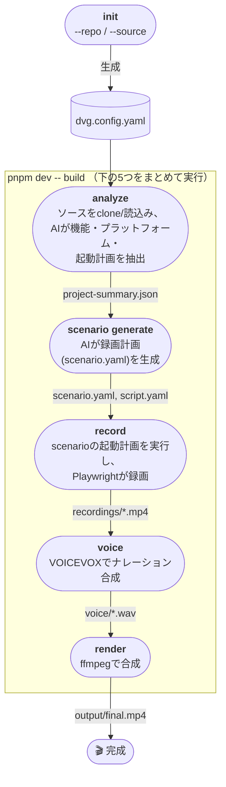

# demo-video-gen

Webアプリ向けのAIプロモーション動画自動生成ツールです。実在するgit管理プロジェクトを
指定すると、実際のソースコードを読み込み、録画計画を立て、実ブラウザを操作し、
ナレーション付きの動画を生成します。

---

## 必要な環境

Node.js ≥ 20、pnpm ≥ 9、git、Docker（VOICEVOX用）。それ以外（ffmpeg、Playwright、
Task、任意でOllama）は下のセットアップコマンドがまとめてインストールします。

## クイックスタート

```bash
git clone <このリポジトリ> && cd demo-video-gen

task install          # 初回のみ: 必要なもの一式をインストール（内訳は task --list）
task serve             # ローカルサービスを起動（VOICEVOX、Ollama）
task doctor              # 何か足りてるか不安なら実行

# 動画化したいプロジェクトと、それが動くURLを指定
pnpm dev -- init --repo https://github.com/you/your-app.git --url http://localhost:3000
#   ローカルに既にある場合は: --source ../your-app

pnpm dev -- build       # 動画を作る
```

`task`コマンドが無くても、下記はすべて`pnpm install`だけで動きます — 各`task`コマンドが
実際に何をしているかは[Taskfile.yml](./Taskfile.yml)に、`pnpm run <name>`という
素のエイリアスは[package.json](./package.json)にあります。

出力先: `output/final.mp4`。`GEMINI_API_KEY`を設定していない場合は自動的にOllamaが
使われます。設定項目の全リストは`examples/dvg.config.yaml`を見てください（各項目に
コメントで説明が書いてあるので、ここでは重複させません）。

---

## 全体の流れ



上図の各箱はそれぞれ独立したCLIコマンドで、すべて`.dvg/`配下のファイルを読み書きします。
つまり`build`はブラックボックスではなく、単にこの5つを順番に実行しているだけです。
個別に実行すれば好きな地点から再開できます（例: `scenario.yaml`を手で編集した後、
`record`以降だけ再実行すればOK）。

| コマンド | 生成物 | 補足 |
|---|---|---|
| `demo-video-gen init --repo <URL>` | `dvg.config.yaml` | 初回のみ。ローカルの場合は`--source <パス>` |
| `demo-video-gen analyze` | `.dvg/source-context.json`、`.dvg/project-summary.json` | 決定論的なソース走査 + AIによる分類 |
| `demo-video-gen scenario generate` | `.dvg/scenario.yaml`、`.dvg/script.yaml`、`.dvg/subtitles.srt` | scenarioはAI生成、script/subtitlesはそこから決定論的に算出 |
| `demo-video-gen record` | `.dvg/recordings/*.mp4` | `target.url`に到達できなければ先にアプリを自動起動 |
| `demo-video-gen voice` | `.dvg/voice/*.wav` | |
| `demo-video-gen render` | `output/final.mp4` | |

`demo-video-gen build [--skip-analyze] [--skip-scenario] [--skip-record] [--skip-voice]`
は上記5つをまとめて実行し、指定したステップだけ既存の生成物を使って
スキップできます。各コマンドの全オプションは`--help`で確認できます
（例: `pnpm dev -- analyze --help`）。

---

## 設定ファイル

`dvg.config.yaml` — 全項目の説明は**[`examples/dvg.config.yaml`](./examples/dvg.config.yaml)**
にコメント付きで書いてあります（gitソース指定、対象URL、動画タイプ、LLMプロバイダー/
フォールバック/タスク別モデル、VOICEVOX等）。ここでは意図的に重複させていません
— あのファイル自体がドキュメントです。

最初に知っておくとよいのは以下の2点です。

- **LLMプロバイダー**: `gemini`（`GEMINI_API_KEY`が必要）か`ollama`（完全ローカル、
  キー不要）。`init`はその時点で使えるほうを自動選択します。`fallbackProvider`を
  設定すれば両方使えます。`analyze`と`scenario generate`は`llm.tasks`で**別々の
  モデル**を指定可能です — `scenario generate`のほうが難しいタスクなので、
  `analyze`より強いモデルが必要になることがあります。
- **アプリの起動**: `analyze`が`package.json`から起動コマンド（`npm run dev`等）を
  自動検出し、`scenario.yaml`の`setup`計画に焼き込みます。`record`/`build`は
  それを使って自動的にアプリを起動します。

---

## トラブルシューティング

### `scenario generate`がスキーマ検証で何度も失敗する

使っているモデルがそのタスクに向いていない可能性が高いです。`llm.tasks.scenario`
だけを別の（より強い）モデルに向けてください（`examples/dvg.config.yaml`参照）。
`analyze`側の設定は変えなくて大丈夫です。警告メッセージには、モデルが具体的に
どのフィールドを間違えたかも表示されます。

### `pnpm install`がffmpegやtaskのダウンロードで失敗する

`ffmpeg-static`や`@go-task/cli`はGitHubリリースからバイナリをダウンロードする
postinstallスクリプトを持っており、社内プロキシ等でブロックされると失敗することが
あります。まず再実行してみてください。ffmpegは手動インストールしても自動検出されます
（`winget install ffmpeg` / `brew install ffmpeg` / `apt install ffmpeg`）。`task`が
無くても`pnpm run <name>`側で代替できます。

### `pnpm run build`や`pnpm dev`が`ERR_PNPM_IGNORED_BUILDS`で失敗する

```bash
pnpm approve-builds
```
を実行し、`ffmpeg-static` / `@go-task/cli` / `esbuild`を承認してください。

### `demo-video-gen init`が「--repo か --source が必要」と言う

`analyze`が実際のソースコードを読む設計のため、`init`の時点で対象を指定する必要が
あります: `demo-video-gen init --repo <URL>` または `--source <パス>`（gitリポジトリ
である必要あり）。

### `scenario.yaml`のURLが実際のページと合っていない

自動ルート検出は現時点でNext.js（App/Pages Router）のみ対応です。
`.dvg/source-context.json`の`routes`が空なら、AIがファイル一覧から推測しているため
精度が落ちます。`scenario.yaml`の`goto`アクションを手動で修正してから`record`して
ください。

### VOICEVOX / Ollamaに接続できない

```bash
task serve          # 両方まとめて起動を試みる
task doctor          # 何が足りないか診断
```

### とにかく何もわからない

```bash
task doctor
```

---

## 開発

```
packages/
├── cli/          コマンド定義（Commander） + 実行ロジック
├── core/         共通の型定義（Zodスキーマ — 正確なフィールド定義はここを見てください）
├── source/       gitクローン/ローカル読込み、ルート・プラットフォーム検出
├── ai/           LLMプロバイダー + analyze/scenario-generateパイプライン
├── playwright/   録画
├── voicevox/     音声合成
└── renderer/     ffmpegレンダリング

scripts/doctor.ts   環境診断（task doctor）
Taskfile.yml        環境構築・サーバー起動
```

```bash
task build          # または: pnpm run build
task dev -- <args>  # または: pnpm dev -- <args>  （先にビルドしてからCLIを実行）
```

## ライセンス

MIT
