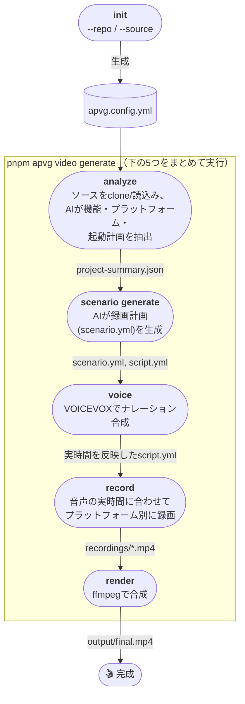

# auto-product-video-generator

WebおよびAndroidアプリ向けのAIプロモーション動画自動生成ツールです。実在するgit管理プロジェクトを
指定すると、実際のソースコードを読み込み、録画計画を立て、ブラウザまたはAndroid端末を操作し、
ナレーション付きの動画を生成します。
CLIアプリは一時的なDockerコンテナ内で実行し、ブラウザ内に描画した専用ターミナルを
Playwrightで録画します。

---

## 実行時に利用する外部環境

npmパッケージではNode.jsやパッケージマネージャーのバージョンを強制していません。また、実行時に
pnpmは必要ありません。gitはリポジトリ取得、Dockerまたは別途起動したVOICEVOX Engineは音声生成、
Android SDK（`adb`、`emulator`）と作成済みAVDはAndroid録画を使う場合にだけ必要です。SDKは
`target.android.sdkPath`、`ANDROID_SDK_ROOT`、`ANDROID_HOME`のいずれかで指定できます。
ブラウザ録画用のChromiumは別途インストールします。`GEMINI_API_KEY`を設定する場合、Ollamaは不要です。

## npmからインストール

```bash
npm install --global auto-product-video-generator
apvg setup
apvg doctor
apvg --help
```

インストール後は`apvg`コマンドを任意のディレクトリから実行できます。pnpmやこのリポジトリの
クローンは必要ありません。`apvg setup`はブラウザ録画用のChromiumをインストールします。
Docker、Ollama、Android SDKなどのOS側ツールは自動インストールせず、`apvg doctor`が不足項目と
導入先のヒントを表示します。

## クイックスタート

設定ファイルや生成物を保存する作業ディレクトリを作り、その中で実行します。

```bash
mkdir my-product-video
cd my-product-video

# VOICEVOXと、GEMINI_API_KEY未設定時はOllamaを起動
apvg serve

# GitHubなどのリモートgitリポジトリを使用する場合
apvg project init --repo https://github.com/you/your-app.git

# 既にローカルにあるgitリポジトリを使用する場合
# apvg project init --source ../your-app

apvg video generate
```

サービスの状態は`apvg services status`で確認できます。`apvg services stop`はAPVGが起動した
VOICEVOXコンテナだけを停止します。OllamaはOSのサービスや他のアプリから利用される可能性が
あるため停止しません。

### 環境構築・サービス管理コマンド

| コマンド | 用途 |
|---|---|
| `apvg setup` | APVGが管理するPlaywright Chromiumをインストール |
| `apvg doctor` | Node.js、git、Docker、動画ツール、Chromium、サービス、設定を診断。不足するOS側ツールは導入ヒントだけを表示 |
| `apvg serve` | DockerでVOICEVOXを起動し、`GEMINI_API_KEY`未設定時はOllamaの起動とモデル取得も実行 |
| `apvg serve --no-ollama` | Ollamaを使わずVOICEVOXだけを起動 |
| `apvg services status` | VOICEVOXとOllamaへの接続状態を確認 |
| `apvg services stop` | APVGが管理するVOICEVOXコンテナだけを停止 |

Docker、Ollama、git、Android SDKは自動インストールしません。`apvg doctor`が表示するヒントを
参考に、各自の環境へ導入してください。モデルやVOICEVOXイメージのオプションは
`apvg serve --help`で確認できます。

Android、Flutter、React Nativeは、GitHub URLまたはローカルソースだけでプラットフォームを判定し、
Debug APKのビルド、停止中AVDの起動、boot待機、application id検出、APKインストール、録画まで
自動実行します。

```bash
apvg project init --repo https://github.com/you/your-android-app.git
apvg video generate
```

接続済み端末があればそれを使い、なければインストール済みAVDの先頭を起動します。AVDが未作成の場合は
Android StudioのDevice Managerで一度作成してください。複数端末や独自ビルドでは
`target.android.avd`、`serial`、`buildCommand`、`apkPath`などを指定できます。
SDKを環境変数で指定しない場合は`target.android.sdkPath`を設定します。
`target.android.activity`は省略可能で、省略時はランチャーActivityを自動起動します。
生成された端末向けシナリオは、安全のため推測したボタン名をタップせず、起動・待機・スワイプを
中心にします。実際のラベルが分かる場合は`.apvg/scenario.yml`へ`tap`、`input_text`、
`back`などを追加してから`apvg video record`を実行できます。

Unityのバッチモードはプロジェクト固有のBuild Methodが必要なため、Unityでは既存APK、または
`target.android.buildCommand`を指定します。生成後のAVD起動・インストール・ADB録画は同じく自動です。
iOSとUnity Desktopの録画は未対応です。

`init`が`apvg.config.yml`を生成します。動画化するソースがGitHub等にある場合は`--repo`、
ローカルにある場合は`--source`を使います。非エンジニア向け・使い方中心という編集方針は
ツール本体のデフォルトなので、設定ファイルへの追記は不要です。
`--url`を省略すると、LLMがpackage.jsonの起動スクリプトとREADMEを読み、起動コマンドと
`localhost`のURL（ポートを含む）を推定してconfigへ保存します。既にURLが決まっている場合だけ
`--url http://localhost:3000`を指定してください。明示指定した値は推定値で上書きされません。

モノレポの場合も通常は追加設定不要です。APVGはclone/updateのたびにワークスペースを走査し、
`apps/web`のような実行可能なWebアプリを優先して、そのディレクトリの画面・ルート・起動コマンドを
解析します。選択結果は`.apvg/source-context.json`の`projectPath`に記録されます。意図したアプリと
異なる場合は`source.platformPriority`で種類の優先順位を変更できます（デフォルトはWebが最優先）。
特定アプリに固定する場合だけ、初期化時の`--project-path apps/web`または
`apvg.config.yml`の`source.projectPath`を使います。初期化時にも、たとえば
`--platform-priority web,android,flutter`と指定できます。
依存関係はモノレポのルートで、開発サーバーは選択したアプリのディレクトリで自動実行されます。

VOICEVOX Engineはホストの`http://localhost:50021`で起動してください。Ollamaを使う場合は
`http://localhost:11434`で起動します。次のコマンドで起動状態を確認できます。

```bash
curl http://localhost:50021/version
curl http://localhost:11434/api/tags  # Ollamaを使う場合のみ
```

出力先は完成動画が`output/final.mp4`、途中生成物が`output/artifacts/`です。
`artifacts/`にはscenario/script、字幕、WAV音声、シーン録画、スクリーンショット、
timeline、分析結果、ログ、使用した設定が保存されます。`GEMINI_API_KEY`を設定して
いない場合は自動的にOllamaが使われます。設定項目の全リストは`examples/apvg.config.yml`を見てください（各項目に
コメントで説明が書いてあるので、ここでは重複させません）。

## GitHub Actionsで自動生成

[generate-demo.yml](./.github/workflows/generate-demo.yml)はGitHub-hostedの
`ubuntu-latest` runnerだけで動画生成を完結します。`main`ブランチへのpushで自動実行され、
Actions画面の`Run workflow`から手動実行することもできます。

対象リポジトリは、手動実行時の`target_repository`入力、またはpush実行時の
GitHub Repository Variable `TARGET_REPOSITORY`で指定します。個人の対象リポジトリは
workflow内に組み込まれていません。

runner内でNode.js、pnpm、Playwright Chromium、システム版ffmpeg、Ollama、VOICEVOX Engineを準備します。
RAM 15 GB以上かつ空きディスク11 GB以上なら`qwen2.5:14b-instruct`、次に7B、
リソースが少ない場合だけ3Bを選び、各CLI工程を順番に実行します。LLM工程後はモデルを
メモリーとディスクから削除してからVOICEVOXを起動します。
Gemini APIキーなどのsecretは不要です。成功するとActions runのArtifactsに
`promotional-video-<run番号>`が追加され、`final.mp4`と`output/artifacts/`一式を
ダウンロードできます。失敗時も`.apvg/`、Ollama、VOICEVOXのログを診断Artifactとして保存します。

GitHub-hosted runnerではOllamaをCPU実行するため時間がかかります。公開リポジトリの
`ubuntu-latest`（16 GB RAM）では、空きディスクも条件を満たせば14Bが選択されます。workflowのtimeoutは
6時間に設定しています。同じブランチへ続けてpushした場合は、古い生成runをキャンセルして
新しいrunを優先します。

---

## 全体の流れ


```mermaid
flowchart TD
    init(["<b>init</b><br/>--repo / --source"]) -->|生成| cfg[(apvg.config.yml)]

    subgraph build["pnpm apvg video generate （下の5つをまとめて実行）"]
        direction TB
        analyze(["<b>analyze</b><br/>ソースをclone/読込み、<br/>AIが機能・プラットフォーム・<br/>起動計画を抽出"])
        scenario(["<b>scenario generate</b><br/>AIが録画計画<br/>(scenario.yml)を生成"])
        voice(["<b>voice</b><br/>VOICEVOXでナレーション合成"])
        record(["<b>record</b><br/>音声の実時間に合わせて<br/>プラットフォーム別に録画"])
        render(["<b>render</b><br/>ffmpegで合成"])
        analyze -->|project-summary.json| scenario
        scenario -->|scenario.yml, script.yml| voice
        voice -->|実時間を反映したscript.yml| record
        record -->|recordings/*.mp4| render
    end

    cfg --> analyze
    render -->|output/final.mp4| done(["🎬 完成"])
```

## 実行方法：一括実行と個別実行

上図の各箱はそれぞれ独立したCLIコマンドで、すべて`.apvg/`配下のファイルを読み書きします。
つまり`build`はブラックボックスではなく、単にこの5つを順番に実行しているだけです。

通常は次の一括実行だけで構いません。

```bash
apvg video generate
```

内容を途中で確認・編集したい場合は、必ず次の順番で個別実行します。

```bash
apvg project analyze
apvg video scenario generate
apvg video voice     # WAV生成後、実音声の長さでscript/subtitlesを更新
apvg video record    # 更新済みscriptとWAVが必須
apvg video render
```

各コマンドは直前の生成物を使います。途中で止まった場合、成功済みの工程を繰り返す必要は
ありません。再開位置の目安は次のとおりです。

| 最後に成功した工程／変更内容 | 再開コマンド |
|---|---|
| `analyze`まで成功 | `apvg video scenario generate` |
| `scenario generate`まで成功 | `apvg video voice` |
| `voice`まで成功 | `apvg video record` |
| `record`まで成功 | `apvg video render` |
| narration・テロップ文言を変更 | `apvg video voice`から |
| 画面操作だけを変更 | `apvg video record`から |
| 録画・音声は完成済みで合成設定だけ変更 | `apvg video render`のみ |

| コマンド | 生成物 | 補足 |
|---|---|---|
| `apvg project init --repo <URL>` | `apvg.config.yml` | 初回のみ。ローカルの場合は`--source <パス>` |
| `apvg project analyze` | `.apvg/source-context.json`、`.apvg/project-summary.json` | 決定論的なソース走査 + AIによる分類 |
| `apvg video scenario generate` | `.apvg/scenario.yml`、`.apvg/script.yml`、`.apvg/subtitles.srt` | scenarioはAI生成、script/subtitlesはそこから決定論的に算出 |
| `apvg video voice` | `.apvg/voice/*.wav` | 実音声の長さでscript/subtitlesの時刻も更新 |
| `apvg video record` | `.apvg/recordings/*.mp4` | 音声の実時間に合わせて操作し、到達不能なら停止 |
| `apvg video render` | `output/final.mp4`、`output/artifacts/` | 完成動画と途中生成物一式を出力 |

各工程は入出力パスを明示指定できます。複数の実行やCIジョブ、動画のバリエーションごとに
`.apvg/`を共有せず、任意の中間ファイルを次の工程へ渡せます。

```bash
apvg project analyze \
  --source-context tmp/source-context.json \
  --project-summary tmp/project-summary.json

apvg video scenario generate \
  --project-summary tmp/project-summary.json \
  --scenario tmp/scenario.yml \
  --script tmp/script.yml \
  --subtitles tmp/subtitles.srt

apvg video voice \
  --script tmp/script.yml \
  --voice-dir tmp/voice \
  --subtitles tmp/subtitles.srt

apvg video record \
  --scenario tmp/scenario.yml \
  --script tmp/script.yml \
  --voice-dir tmp/voice \
  --recordings-dir tmp/recordings \
  --screenshots-dir tmp/screenshots

apvg video render \
  --scenario tmp/scenario.yml \
  --script tmp/script.yml \
  --voice-dir tmp/voice \
  --recordings-dir tmp/recordings \
  --screenshots-dir tmp/screenshots \
  --subtitles-file tmp/subtitles.srt \
  --timeline tmp/timeline.json \
  --output tmp/final.mp4 \
  --artifacts-dir tmp/artifacts
```

相対パスは現在のディレクトリを基準に解決され、絶対パスも指定できます。省略した項目は
上表の既定パスを使います。source clone/cacheやdev server logのパスも指定できるため、
詳細は各コマンドの`--help`を参照してください。

`apvg video generate [--skip-analyze] [--skip-scenario] [--skip-record] [--skip-voice]`
は上記5つをまとめて実行し、指定したステップだけ既存の生成物を使って
スキップできます。各コマンドの全オプションは`--help`で確認できます
（例: `apvg project analyze --help`）。CLI全体は`apvg --help`で確認できます。

`--skip-voice`と録画を組み合わせる場合も、既存の`.apvg/voice/*.wav`が必要です。
録画前に既存WAVを測り直すため、音声なしの状態で録画だけを先行することはできません。
ナレーションや`sceneGapSeconds`を変更した場合は、`voice → record → render`を再実行してください。

### CLIプロジェクトの録画

`package.json`の`bin`、または既知のCLIフレームワークを持つプロジェクトは`cli`として
判定されます。APVGは同梱する`packages/recorder/docker/cli/Dockerfile`をビルドし、リポジトリ
ルートを読み取り専用でマウントして、除外適用後の内容を一時コンテナ内へコピーします。
モノレポでも選択したCLIのワークスペース依存を維持できます。コマンド出力は専用のブラウザ内
ターミナルへ表示してPlaywrightで録画します。コンテナは全シーンで再利用し、コマンド失敗時を
含めて録画終了後に削除します。

```yml
actions:
  - type: run_command
    command: "my-tool --help"
  - type: wait
    ms: 1000
```

自動判定や同梱イメージを変更するときだけ、`target.type: cli`と`target.cli`を指定します。
録画工程ではDockerが必要です。VOICEVOXと動画合成はWeb録画と同じパイプラインを使用します。

自動生成するCLIシーンは、有限かつ読み取り専用の`--help`/`--version`コマンドに制限されます。
シェル制御演算子は常に録画直前にも拒否します。別のコマンドを使う場合は
`target.cli.allowedCommands`へ完全一致で許可します。その明示許可では
`target.cli.deniedCommandPatterns`が優先されます。解析時に動画・音声の中身をLLMへ送ることはありません。一般的なビルド・メディア
生成物、ルート`.gitignore`、`source.exclude`のgitignore形式パターンは、LLM向けファイル一覧と
CLI用一時ワークスペースの両方から除外されます。

---

## 設定ファイル

`apvg.config.yml` — 全項目の説明は**[`examples/apvg.config.yml`](./examples/apvg.config.yml)**
にコメント付きで書いてあります（gitソース指定、対象URL、動画タイプ、LLMプロバイダー/
フォールバック/タスク別モデル、VOICEVOX等）。ここでは意図的に重複させていません
— あのファイル自体がドキュメントです。

最初に知っておくとよいのは以下の4点です。

- **LLMプロバイダー**: `gemini`（`GEMINI_API_KEY`が必要）か`ollama`（完全ローカル、
  キー不要）。`init`はその時点で使えるほうを自動選択します。APIキーが設定済みの
  プロバイダーだけを`fallbackProvider`に指定できます。必須APIキーが未設定の
  フォールバックは自動的に無効化されます。`analyze`と`scenario generate`は`llm.tasks`で**別々の
  モデル**を指定可能です — `scenario generate`のほうが難しいタスクなので、
  `analyze`より強いモデルが必要になることがあります。
- **アプリの起動**: `analyze`が`package.json`から起動コマンド（`npm run dev`等）を
  自動検出し、`scenario.yml`の`setup`計画に焼き込みます。`record`/`build`は
  それを使って自動的にアプリを起動します。`target.url`へ到達できない場合やブラウザ操作が
  失敗した場合は、白画面や部分録画を完成品にせずエラーで停止します。
- **シーン間の無音**: `video.sceneGapSeconds`（デフォルト`1`秒）で、ナレーションと
  シーンの間隔を調整できます。この値は音声合成後のscript、字幕、録画時間へ反映されます。
- **字幕の1行表示**: `video.singleLineSubtitles`（デフォルト`true`）を有効にすると、
  ナレーションを約14文字以内の短い字幕に単語の区切りを保って分割し、合成した音声に
  合わせて順番に表示します。`false`にすると、シーンの文章全体を1つの字幕として表示します。
  どちらを選んでも、音声合成には分割前の文章全体が使われます。
- **Web画面の準備待ち**: `video.pageReadyWaitSeconds`（デフォルト`2`秒）で、最初の
  ページ読み込み完了後に画面が落ち着くまで待つ時間を指定できます。読み込み中の白画面と
  待機区間は録画素材から除去され、音声・テロップは準備完了後から始まります。
- **編集方針**: 設定不要の組み込みデフォルトとして、非エンジニアを対象に、技術仕様では
  なく実際の使い方、できること、利用者のメリットを紹介します。
  App Router、TypeScript、Cloudflare、Hono、APIなどの実装用語がナレーションへ
  入った場合は検証エラーとして再生成されます。

---

## トラブルシューティング

### `scenario generate`がスキーマ検証で何度も失敗する

使っているモデルがそのタスクに向いていない可能性が高いです。`llm.tasks.scenario`
だけを別の（より強い）モデルに向けてください（`examples/apvg.config.yml`参照）。
`analyze`側の設定は変えなくて大丈夫です。警告メッセージには、モデルが具体的に
どのフィールドを間違えたかも表示されます。

### `npm install --global`がffmpegのダウンロードで失敗する

`ffmpeg-static`はインストール時にバイナリをダウンロードします。社内プロキシなどで
ブロックされた場合は、ネットワーク設定を確認してから再実行してください。ffmpegを
手動インストールした場合も自動検出されます
（`winget install ffmpeg` / `brew install ffmpeg` / `apt install ffmpeg`）。

### インストール後に`apvg`コマンドが見つからない

ターミナルを開き直し、npmのグローバルbinディレクトリが`PATH`に含まれているか確認してください。
グローバルインストール先は`npm prefix --global`で確認できます。

### Chromiumを起動できない

```bash
apvg setup
```

### `apvg project init`が「--repo か --source が必要」と言う

`analyze`が実際のソースコードを読む設計のため、`init`の時点で対象を指定する必要が
あります: `apvg project init --repo <URL>` または `--source <パス>`（gitリポジトリ
である必要あり）。

### `scenario.yml`のURLが実際のページと合っていない

自動ルート検出は現時点でNext.js（App/Pages Router）のみ対応です。
`.apvg/source-context.json`の`routes`が空なら、AIがファイル一覧から推測しているため
精度が落ちます。`scenario.yml`の`goto`アクションを手動で修正してから`record`して
ください。

### VOICEVOX / Ollamaに接続できない

```bash
apvg serve          # 必要なサービスを起動
apvg doctor         # 不足している外部環境を診断
```

Docker Composeを使う場合は、少なくともVOICEVOXの`50021:50021`を公開してください。
Ollamaもコンテナで動かす場合は`11434:11434`が必要です。`voice`が成功する前に`record`へ
進むことはできません。

### 録画が対象URLやブラウザ操作のエラーで停止する

まず`target.url`を通常のブラウザで開けるか確認してください。次に`.apvg/scenario.yml`の
`goto`、`click`、`wait_visible`が実際の画面と合っているか確認します。修正後は音声を
変えていなければ`apvg video record`、ナレーションも変えた場合は
`apvg video voice`から再実行してください。

### とにかく何もわからない

```bash
apvg doctor
```

---

## 開発

```
packages/
├── cli/          コマンド定義（Commander） + 実行ロジック
├── core/         共通の型定義（Zodスキーマ — 正確なフィールド定義はここを見てください）
├── source/       gitクローン/ローカル読込み、ルート・プラットフォーム検出
├── ai/           LLMプロバイダー + analyze/scenario-generateパイプライン
├── playwright/   Web録画
├── recorder/     プラットフォーム選択 + Android/ADB録画
├── voicevox/     音声合成
└── renderer/     ffmpegレンダリング

scripts/doctor.ts   環境診断（pnpm doctor）
Taskfile.yml        環境構築・サーバー起動
```

```bash
pnpm build          # CI・配布前の型チェック／JS生成
pnpm apvg --help    # ソースからCLIのコマンド一覧を確認
```

### npmへの公開

npmへ公開するのは`packages/cli`の`auto-product-video-generator`だけです。`core`、`ai`、
`recorder`などは開発時のコード整理用で、CLIの`dist/index.js`へバンドルされます。個別のnpm
パッケージとしては公開しません。

ローカルで公開内容を検証するには次を実行します。

```bash
pnpm install
pnpm release:check
```

#### 初回公開とTrusted Publishingの登録

npmのTrusted Publishingは既に存在するパッケージに対して設定します。パッケージがまだnpmに
存在しない場合、最初の1回だけローカルから2FAのOTPを使って公開してください。

```bash
npm login
cd packages/cli
npm publish --access public --otp=<認証アプリの6桁コード>
cd ../..
```

初回公開後、npm 11.15.0以上を使ってGitHub ActionsをTrusted Publisherとして登録します。

```bash
npm install --global npm@^11.15.0
npm trust github auto-product-video-generator --repo TakuKobayashi/auto-product-video-generator --file publish-npm.yml --allow-publish
npm trust list auto-product-video-generator
```

登録内容はリポジトリ`TakuKobayashi/auto-product-video-generator`、workflow
`publish-npm.yml`、許可操作`npm publish`、Environment未指定にします。workflow本体は
`.github/workflows/publish-npm.yml`にあります。Trusted PublishingはGitHub OIDCの短時間
認証を使うため、`NPM_TOKEN`などの長期トークンをGitHub Secretsへ登録する必要はありません。

#### タグによる自動公開

`packages/cli/package.json`の`version`を更新してmainへpushし、同じバージョンの`v`タグを
pushします。例えば`0.2.0`を公開する場合は次のとおりです。

```bash
git tag v0.2.0
git push origin v0.2.0
```

GitHub Actionsはテスト、ビルド、タグとCLIバージョンの照合を行い、`packages/cli`だけを
公開します。通常版にはnpm dist-tag `latest`、`v0.2.0-beta.1`のようなプレリリースには
`next`を付けます。一度npmへ公開したバージョンは再利用できません。

自動公開が`OIDC token exchange error - package not found`で失敗した場合は、まず次を確認します。

```bash
npm trust list auto-product-video-generator
```

`No trust configurations found`なら、上記の`npm trust github ...`を実行してから失敗したActionsを
再実行できます（そのバージョンがまだnpmへ公開されていない場合）。publish失敗時はActions runの
Artifactsに`npm-publish-diagnostics-<run番号>`が7日間保存され、npm debug log、Node/npm
バージョン、OIDC変数の有無を確認できます。認証値そのものはArtifactへ保存しません。

## ライセンス

MIT
