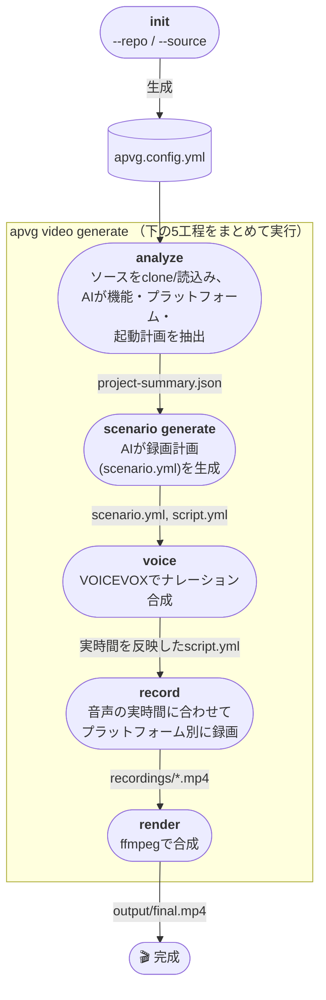

# auto-product-video-generator

## GitHub Action

UbuntuのGitHub-hosted runner上で、対象リポジトリの解析、シナリオ生成、VOICEVOXまたはAI Talkによる音声生成、画面録画、動画レンダリングまで実行できます。

```yaml
name: Generate product video

on:
  workflow_dispatch:

permissions:
  contents: read

jobs:
  video:
    runs-on: ubuntu-latest
    timeout-minutes: 360
    steps:
      - uses: actions/checkout@v6
      - id: apvg
        uses: TakuKobayashi/auto-product-video-generator@v1
        with:
          apvg-version: latest
          video-type: demo
          ollama-model: qwen2.5:7b-instruct
          export-remotion: 'true'
      - uses: actions/upload-artifact@v7
        with:
          name: promotional-video
          path: ${{ steps.apvg.outputs['artifacts-path'] }}
```

Marketplace Actionでは、編集可能なRemotionプロジェクトも既定で生成され、
`artifacts-path`配下の`remotion-project/`に含まれます。個別のパスは
`remotion-project-path`から取得できます。不要な場合は
`export-remotion: 'false'`を指定してください。

既定では、workflowが実行されているリポジトリ自身をcheckoutして解析します。別の公開リポジトリを対象にする場合だけ、`repository`へGit URLを指定してください。生成されたMP4は`video-path`、中間ファイルを含む出力ディレクトリは`artifacts-path`から取得できます。

Marketplace Actionはnpmパッケージの薄いラッパーです。既定では`auto-product-video-generator@latest`をインストールします。再現性を優先する場合は、`apvg-version: 0.3.0`のようにnpmバージョンを固定できます。

Web、CLI、Androidアプリ向けのAIプロモーション動画自動生成ツールです。実在するgit管理プロジェクトを
指定すると、実際のソースコードを読み込み、録画計画を立て、ブラウザまたはAndroid端末を操作し、
ナレーション付きの動画を生成します。
CLIアプリは一時的なDockerコンテナ内で実行し、ブラウザ内に描画した専用ターミナルを
Playwrightで録画します。

## 対応プラットフォーム

| 対象                   | 録画方法                                   | 対応状況 |
| ---------------------- | ------------------------------------------ | -------- |
| Webアプリ              | Playwright Chromium                        | 対応     |
| CLIアプリ              | Docker内のブラウザターミナル               | 対応     |
| Android                | adbによる端末・エミュレーター録画          | 対応     |
| Flutter / React Native | Android APKをビルドしてadb録画             | 対応     |
| Unity                  | Unity RecorderでBuild SettingsのSceneを録画 | 対応     |
| iOS                    |                                            | 未対応   |

---

## セットアップ

### 1. 必要なツールをインストール

| ツール         | 必要になる場面                                  | インストール                                                      |
| -------------- | ----------------------------------------------- | ----------------------------------------------------------------- |
| Node.js 20以上 | 常に必要                                        | [Node.js公式サイト](https://nodejs.org/)                          |
| git            | 対象リポジトリの取得と解析                      | [Git公式ダウンロード](https://git-scm.com/downloads)              |
| Docker         | `apvg serve`によるVOICEVOX起動、CLIアプリの録画 | [Docker Desktop](https://www.docker.com/products/docker-desktop/) |
| Ollama         | ローカルLLMを使う場合                           | [Ollama公式ダウンロード](https://ollama.com/download)             |

LLMはOllamaまたはGeminiを利用できます。Geminiを使う場合は
[Google AI Studio](https://aistudio.google.com/apikey)でAPIキーを発行し、`GEMINI_API_KEY`へ
設定してください。この場合、Ollamaは不要です。Androidアプリの録画には追加の準備が必要です。詳しくは
[Androidアプリを録画する場合](#androidアプリを録画する場合)を参照してください。

### 2. APVGをインストール

```bash
npm install --global auto-product-video-generator
apvg setup
apvg doctor
apvg --help
```

`apvg setup`はブラウザ録画用のPlaywright Chromiumをインストールします。npm版の利用に
pnpmやこのリポジトリのcloneは必要ありません。`apvg doctor`で不足しているツールや
サービスを確認できます。

## クイックスタート

設定ファイルや生成物を保存する作業ディレクトリを作り、その中で実行します。

```bash
mkdir my-product-video
cd my-product-video

# VOICEVOXと、GEMINI_API_KEY未設定時はOllamaを起動
apvg serve

# GitHubなどのリモートgitリポジトリを使用する場合
apvg project init --repo https://github.com/you/your-app.git

# 既にローカルにあるgitリポジトリを使用する場合
# apvg project init --source ../your-app

apvg video generate
```

サービスの状態は`apvg services status`で確認できます。`apvg services stop`はAPVGが起動した
VOICEVOXコンテナだけを停止します。OllamaはOSのサービスや他のアプリから利用される可能性が
あるため停止しません。

### 環境構築・サービス管理コマンド

| コマンド                 | 用途                                                                               |
| ------------------------ | ---------------------------------------------------------------------------------- |
| `apvg setup`             | APVGが管理するPlaywright Chromiumをインストール                                    |
| `apvg doctor`            | Node.js、git、Docker、動画ツール、Chromium、LLM、VOICEVOXの状態を確認              |
| `apvg serve`             | DockerでVOICEVOXを起動し、`GEMINI_API_KEY`未設定時はOllamaの起動とモデル取得も実行 |
| `apvg serve --no-ollama` | Ollamaを使わずVOICEVOXだけを起動                                                   |
| `apvg services status`   | VOICEVOXとOllamaへの接続状態を確認                                                 |
| `apvg services stop`     | APVGが管理するVOICEVOXコンテナだけを停止                                           |

`apvg serve`はVOICEVOXをDockerで起動します。Ollamaを利用する構成では、インストール済みの
Ollamaを起動して、設定されたモデルも取得します。モデルやVOICEVOXイメージを変更する場合は
`apvg serve --help`を参照してください。

## Androidアプリを録画する場合

Android、Flutter、React Nativeアプリの録画では、[Android Studio](https://developer.android.com/studio)を
インストールし、SDK Managerから次のツールを追加してください。

- Android SDK Platform-Tools（`adb`）
- Android Emulator
- 対象アプリのビルドに必要なAndroid SDK

エミュレーターを使う場合は、Android StudioのDevice ManagerでAVDを1つ作成します。Android SDKの
場所は通常`ANDROID_SDK_ROOT`または`ANDROID_HOME`で検出されます。検出できない場合だけ
`target.android.sdkPath`を設定してください。

APVGはプラットフォームを判定し、Debug APKのビルド、端末の準備、APKのインストール、録画を
自動実行します。

```bash
apvg project init --repo https://github.com/you/your-android-app.git
apvg video generate
```

接続済み端末があればその端末を使い、なければ作成済みAVDを起動します。複数端末の選択や
独自のAPKビルドが必要な場合は、`target.android.serial`、`avd`、`buildCommand`、`apkPath`を
設定できます。ランチャーActivityは自動検出されるため、通常`activity`の指定は不要です。

生成直後のシナリオは、安全な起動・待機・スワイプを中心に構成されます。必要に応じて
`.apvg/scenario.yml`へ`tap`、`input_text`、`back`などの操作を追加してください。

### Unity RecorderでSceneを録画する場合

ローカルのUnity EditorとUnity Recorderを使い、Build Settingsで有効になっているSceneの
Game Viewを順番に録画できます。対象Unityプロジェクトへ`com.unity.recorder`を
インストールしてから、次のように初期化してください。

```bash
apvg project init --source ../MyUnityProject
apvg project analyze
apvg video scenario generate
apvg video voice
apvg video record
apvg video render
```

通常は`ProjectSettings/ProjectVersion.txt`と一致するUnity HubのEditorを自動検出します。
別の場所にインストールしている場合は、初期化時の`--unity-editor <path>`または
`target.unity.editorPath`で指定できます。APVGのシナリオSceneとBuild Settingsの有効Sceneは
先頭から順に対応します。明示的な順番にしたい場合は`target.unity.scenes`へSceneのAssetパスを
記述してください。録画中、同じUnityプロジェクトを別のEditorで開かないでください。

```yaml
target:
  type: unity
  unity:
    # editorPath: C:/Program Files/Unity/Hub/Editor/6000.0.65f1/Editor/Unity.exe
    # scenes:
    #   - Assets/Scenes/Title.unity
    #   - Assets/Scenes/Game.unity
    sceneStartIndex: 0
    sceneLoadWaitSeconds: 2
    includeAudio: false
    timeoutSeconds: 900
```

## 初期化と自動検出

### 設定ファイルを作る

`apvg project init`が`apvg.config.yml`を生成します。リモートリポジトリには`--repo`、
ローカルのgitリポジトリには`--source`を指定します。

### URLと起動コマンドを検出する

`--url`を省略すると、`package.json`とREADMEから開発サーバーの起動コマンドとlocalhost URLを
推定します。URLが決まっている場合は`--url http://localhost:3000`のように指定してください。

### モノレポから対象アプリを選ぶ

モノレポでは実行可能なアプリを自動選択します。対象を固定する場合は`source.projectPath`、
プラットフォームの優先順を変える場合は`source.platformPriority`を設定してください。

### 解析から不要なファイルを除く

動画、音声、3Dモデル、ビルド生成物など、内容の解析に適さないファイルは自動的に除外します。
`.gitignore`と`source.exclude`に一致するファイルもLLMへ送りません。

### 生成結果を確認する

完成動画は`output/final.mp4`、途中生成物は`output/artifacts/`へ出力されます。VOICEVOXと
Ollamaの状態は`apvg services status`で確認できます。

### 録画対象アプリへ`.env`ファイルを渡す

録画対象アプリの起動にAPIキーなどの環境変数が必要な場合は、普段利用している`.env`
ファイルのパスを`source.environmentFile`へ指定できます。

```yaml
source:
  localPath: /path/to/product
  environmentFile: /secure/path/product.env
```

設定ファイルを変更せず、コマンドから`.env`ファイルを指定することもできます。

```bash
apvg video record --env-file /secure/path/product.env
apvg video generate --env-file /secure/path/product.env
```

APVGはアプリのビルド・起動前に、指定された`.env`ファイルを選択済みのアプリへ配置します。
通常のWebプロジェクトでは`.env`のまま配置し、Cloudflareプロジェクトでは`.dev.vars`、
Androidプロジェクトでは`local.properties`（Flutter・React Nativeでは`android/`配下）へ
自動的に変換します。配置先は所有者のみ読み書き可能にします。機密情報を含むため、入力元の
`.env`ファイルと配置されたファイルはcommitしないでください。

## ログインが必要なWebアプリを録画する場合

最初に認証状態の保存先を設定します。

```yaml
target:
  url: 'https://example.com/dashboard'
  type: web
  auth:
    mode: manual
    loginUrl: 'https://example.com/login'
    successUrl: 'https://example.com/dashboard' # 省略可能
    storageStatePath: './.apvg/auth/storage-state.json'
```

次のコマンドでブラウザを開き、一度だけ手動でログインします。

```bash
apvg auth login
```

`successUrl`を設定した場合は、そのURLへ到達すると認証状態を保存します。省略した場合は、
ログイン完了後にターミナルでEnterを押してください。以降のWeb録画では保存済みの状態を
自動的に読み込みます。

認証状態にはCookieやlocal storageなどが含まれます。デフォルトの保存先はgit管理対象外の
`.apvg/`配下ですが、リポジトリへのcommit、Artifactへのアップロード、第三者との共有は
しないでください。この認証機能はWeb録画専用です。

## GitHub Actionsで自動生成

[generate-demo.yml](./.github/workflows/generate-demo.yml)はGitHub-hostedの
`ubuntu-latest` runnerだけで動画生成を完結します。`main`ブランチへのpushで自動実行され、
Actions画面の`Run workflow`から手動実行することもできます。

手動実行では`target_repository`へ録画対象のgitリポジトリURLを指定できます。未指定時と
`main`へのpush時は、workflowの`TARGET_REPOSITORY`に記載された既定リポジトリを使用します。
別のプロジェクトを既定値にする場合は、[generate-demo.yml](./.github/workflows/generate-demo.yml)の
値を変更してください。

### Runner内で準備するもの

workflowはGitHub-hosted runner上に、次の実行環境を準備します。

- Node.js、pnpm、プロジェクトの依存パッケージ
- Playwright Chromiumとシステム版ffmpeg
- Ollamaと`apvg.config.yml`で指定したモデル
- VOICEVOX Engine

LLM処理が完了したらOllamaモデルを解放してからVOICEVOXを起動し、限られたメモリーと
ディスクを動画処理へ回します。Gemini APIキーなどのsecretは不要です。

### Ollamaモデルの選び方

workflowは`apvg.config.yml`に指定されたモデルを使用します。標準構成の
`qwen2.5:7b-instruct`は品質と実行時間のバランスがよい推奨モデルです。より大きなrunnerを
利用でき、生成品質を優先する場合は`qwen2.5:14b-instruct`など、より高性能なモデルへ
変更できます。`llm.model`のほか、`llm.tasks.analyze`と`llm.tasks.scenario`で工程ごとに
モデルを指定できます。

成功するとActions runのArtifactsに
`promotional-video-<run番号>`が追加され、`final.mp4`と`output/artifacts/`一式を
ダウンロードできます。失敗時も`.apvg/`、Ollama、VOICEVOXのログを診断Artifactとして保存します。

GitHub-hosted runnerではOllamaをCPUで実行するため、モデルサイズによって所要時間が変わります。
workflowのtimeoutは6時間です。同じブランチへ続けてpushした場合は、古いrunをキャンセルして
新しいrunを優先します。

---

## 全体の流れ


```mermaid
flowchart TD
    init(["<b>init</b><br/>--repo / --source"]) -->|生成| cfg[(apvg.config.yml)]

    subgraph build["apvg video generate （下の5工程をまとめて実行）"]
        direction TB
        analyze(["<b>analyze</b><br/>ソースをclone/読込み、<br/>AIが機能・プラットフォーム・<br/>起動計画を抽出"])
        scenario(["<b>scenario generate</b><br/>AIが録画計画<br/>(scenario.yml)を生成"])
        voice(["<b>voice</b><br/>VOICEVOXでナレーション合成"])
        record(["<b>record</b><br/>音声の実時間に合わせて<br/>プラットフォーム別に録画"])
        render(["<b>render</b><br/>ffmpegで合成"])
        analyze -->|project-summary.json| scenario
        scenario -->|scenario.yml, script.yml| voice
        voice -->|実時間を反映したscript.yml| record
        record -->|recordings/*.mp4| render
    end

    cfg --> analyze
    render -->|output/final.mp4| done(["🎬 完成"])
```

## 実行方法：一括実行と個別実行

`apvg video generate`は、上図の5工程を順番に実行します。通常はこの一括実行を使用します。

```bash
apvg video generate
```

内容を途中で確認・編集したい場合は、必ず次の順番で個別実行します。

```bash
apvg project analyze
apvg video scenario generate
apvg video voice     # WAV生成後、実音声の長さでscript/subtitlesを更新
apvg video record    # 更新済みscriptとWAVが必須
apvg video render
```

各コマンドは直前の生成物を使います。途中で止まった場合、成功済みの工程を繰り返す必要は
ありません。再開位置の目安は次のとおりです。

| 最後に成功した工程／変更内容           | 再開コマンド                   |
| -------------------------------------- | ------------------------------ |
| `analyze`まで成功                      | `apvg video scenario generate` |
| `scenario generate`まで成功            | `apvg video voice`             |
| `voice`まで成功                        | `apvg video record`            |
| `record`まで成功                       | `apvg video render`            |
| narration・テロップ文言を変更          | `apvg video voice`から         |
| 画面操作だけを変更                     | `apvg video record`から        |
| 録画・音声は完成済みで合成設定だけ変更 | `apvg video render`のみ        |

| コマンド                         | 生成物                                                                                  | 補足                                                       |
| -------------------------------- | --------------------------------------------------------------------------------------- | ---------------------------------------------------------- |
| `apvg project init --repo <URL>` | `apvg.config.yml`                                                                       | 初回のみ。ローカルの場合は`--source <パス>`                |
| `apvg project analyze`           | `.apvg/source-context.json`、`.apvg/project-summary.json`、`.apvg/resolved-config.json` | 決定論的なソース走査 + AIによる分類と実行時設定            |
| `apvg video scenario generate`   | `.apvg/scenario.yml`、`.apvg/script.yml`、`.apvg/subtitles.srt`                         | scenarioはAI生成、script/subtitlesはそこから決定論的に算出 |
| `apvg video voice`               | `.apvg/voice/*.wav`                                                                     | 実音声の長さでscript/subtitlesの時刻も更新                 |
| `apvg video record`              | `.apvg/recordings/*.mp4`                                                                | 音声の実時間に合わせて操作し、到達不能なら停止             |
| `apvg video render`              | `output/final.mp4`、`output/artifacts/`                                                 | 完成動画と途中生成物一式を出力                             |

### 生成結果を確認・調整する

| 操作                                   | コマンド                                          |
| -------------------------------------- | ------------------------------------------------- |
| 低画質のプレビューを素早く生成         | `apvg video generate --preview`                   |
| ブラウザを表示しながら録画             | `apvg video generate --headed`                    |
| 字幕なしで生成                         | `apvg video generate --no-subtitles`              |
| 音声なしで再レンダリング               | `apvg video render --no-voice`                    |
| 指定シーンだけ録画し直す               | `apvg video record --scene <シーンID>`            |
| 指定シーンだけ音声を作り直す           | `apvg video voice --scene <シーンID>`             |
| 編集したscenarioを検証                 | `apvg video scenario validate .apvg/scenario.yml` |
| ファイル生成や外部処理をせず計画を確認 | `apvg video generate --dry-run`                   |

`apvg video generate [--skip-analyze] [--skip-scenario] [--skip-record] [--skip-voice]`
は上記5つをまとめて実行し、指定したステップだけ既存の生成物を使って
スキップできます。各コマンドの全オプションは`--help`で確認できます
（例: `apvg project analyze --help`）。CLI全体は`apvg --help`で確認できます。

`--skip-voice`と録画を組み合わせる場合も、既存の`.apvg/voice/*.wav`が必要です。
録画前に既存WAVを測り直すため、音声なしの状態で録画だけを先行することはできません。
ナレーションや`sceneGapSeconds`を変更した場合は、`voice → record → render`を再実行してください。

## CLIプロジェクトを録画する場合

`package.json`の`bin`や既知のCLIフレームワークからCLIプロジェクトを自動判定します。
対象は一時的なDockerコンテナ内で実行され、コマンド出力をブラウザ内ターミナルへ表示して
Playwrightで録画します。コンテナは録画終了後に削除されます。

```yml
actions:
  - type: run_command
    command: 'my-tool --help'
  - type: wait
    ms: 1000
```

録画にはDockerが必要です。自動判定やコンテナ設定を変更する場合だけ、`target.type: cli`と
`target.cli`を指定してください。

自動生成するCLIシーンは、有限かつ読み取り専用の`--help`/`--version`コマンドに制限されます。
シェル制御演算子は常に録画直前にも拒否します。別のコマンドを使う場合は
`target.cli.allowedCommands`へ完全一致で許可します。その明示許可では
`target.cli.deniedCommandPatterns`が優先されます。

---

## ナレーション・音声・シナリオのカスタマイズ

ナレーションはデフォルトで、読み上げに適した自然な口語体になります。キャラクターや
口調を指定する場合は、追加プロンプトを記述できます。

```yaml
video:
  # 省略時は長さ無制限。指定時はおおよその目標尺になります。
  # duration: 90
  scenarioPrompt: |
    ずんだもんらしい親しみやすい口調にしてください。
    語尾には自然に「なのだ」を付けてください。
  subtitles: true # falseにすると字幕なしでrender
```

一時的な上書きには`apvg video scenario generate --prompt "..."`、一括生成では
`apvg video generate --scenario-prompt "..."`を利用できます。最終的な動画尺は合成音声の
実時間に追従します。`video.duration`を指定した場合だけ、LLMがシーン数と文章量を目標尺へ
近づけます。

複数の音声プロファイルは定義順でシーンへ割り当てられ、末尾まで行くと先頭へ戻ります。

```yaml
voice:
  profiles:
    - name: character-a
      type: voicevox
      url: http://localhost:50021
      speakerId: 1
    - name: character-b
      type: aitalk
      url: https://webapi.aitalk.jp/webapi/v5/ttsget.php
      speakerName: nozomi
      username: ${AITALK_USERNAME}
      password: ${AITALK_PASSWORD}
      # https://www.ai-j.jp/manual/business/webapi/5/modules/Api/TTSGet.html
      options:
        use_udic: true
        ext: wav
        fs: auto
        bit: 16
        channels: 1
        mvolume: 1.0
        volume: 1.0
        speed: 1.0
        pitch: 1.0
        range: 1.0
        style:
          j: 0.5 # 喜び
          s: 0.15 # 悲しみ
          a: 0.35 # 怒り
        spause: 150
        lpause: 370
        epause: 800
        tpause: 0
```

AI Talkプロファイルに`options.style`があれば、割り当てられた全シーンでその値を使います。
省略した場合は、シナリオ生成時にナレーションごとの感情を分析し、`j`、`s`、`a`を
自動生成します。configの固定指定が常に優先されます。

### 環境変数プレースホルダー

YAML内のすべての文字列で`${ANY_ENV_KEY}`を利用できます。`apvg.config.yml`と同じ場所の
`.env`と`.env.local`は自動で読み込まれ、`voice.envFile`で追加のdotenvファイルも指定
できます。値はメモリ上だけで展開され、秘密値がconfigへ書き戻されることはありません。

### 解析結果とconfigの分離

`apvg.config.yml`は利用者が管理する設定として扱い、`analyze`や`build`では書き換えません。
検出したURL、起動コマンド、プラットフォームなどは`.apvg/resolved-config.json`へ保存します。
後続工程ではconfigと中間ファイルをメモリ上で合成し、利用者が明示した設定を優先します。

## 設定ファイル

設定は`apvg.config.yml`に記述します。値を含む完全な例は
[`examples/apvg.config.yml`](./examples/apvg.config.yml)を参照してください。以下は未指定時の
値または自動検出動作です。configを作成するのは`project init`だけで、解析結果は
`.apvg/resolved-config.json`へ保存されます。

### プロジェクトとソース

| YAMLキー                  | 機能             | 必須         | デフォルト値                                                                                           | 説明                                                          |
| ------------------------- | ---------------- | ------------ | ------------------------------------------------------------------------------------------------------ | ------------------------------------------------------------- |
| `project.name`            | プロジェクト名   | 必須         |                                                                                                        | 動画化する製品名                                              |
| `project.description`     | 製品説明         | 任意         |                                                                                                        | 任意の補足説明                                                |
| `source.repository`       | リモートソース   | どちらか必須 |                                                                                                        | gitリポジトリURL                                              |
| `source.localPath`        | ローカルソース   | どちらか必須 |                                                                                                        | ローカルgitリポジトリのパス。`repository`とどちらか一方を指定 |
| `source.ref`              | git参照          | 任意         |                                                                                                        | 使用するbranch、tag、commit                                   |
| `source.installDeps`      | 依存関係の導入   | 任意         | `false`                                                                                                | アプリ起動前に依存パッケージをインストール                    |
| `source.environmentFile`  | 環境変数ファイル | 任意         |                                                                                                        | プロジェクト形式へ変換し、アプリ起動前に配置                  |
| `source.startCommand`     | アプリ起動       | 任意         | 自動検出                                                                                               | 開発サーバーの起動コマンド                                    |
| `source.projectPath`      | モノレポ選択     | 任意         | 自動選択                                                                                               | 動画化するアプリのディレクトリ                                |
| `source.platformPriority` | 検出優先順       | 任意         | `web`<br>`cli`<br>`android`<br>`flutter`<br>`react-native`<br>`unity`<br>`ios`<br>`desktop`<br>`other` | 複数アプリがある場合のプラットフォーム優先順                  |
| `source.exclude`          | 解析対象外       | 任意         | `[]`                                                                                                   | ソース解析から除外するgitignore形式のパターン                 |

### 録画対象

| YAMLキー                       | 機能             | 必須 | デフォルト値                      | 説明                                                |
| ------------------------------ | ---------------- | ---- | --------------------------------- | --------------------------------------------------- |
| `target.url`                   | 対象URL          | 必須 |                                   | Webアプリまたは録画用画面のURL                      |
| `target.autoDetectUrl`         | URL自動検出      | 任意 | `false`                           | 解析結果からlocalhost URLを更新                     |
| `target.type`                  | 録画方式         | 任意 | `web`                             | `web`<br>`cli`<br>`android`<br>`ios`から選択        |
| `target.auth.mode`             | Web認証          | 任意 | `manual`                          | 現在は`manual`に対応                                |
| `target.auth.loginUrl`         | ログインURL      | 任意 | `target.url`                      | 手動ログイン時に最初に開くURL                       |
| `target.auth.successUrl`       | ログイン完了判定 | 任意 |                                   | このURLへの到達時に認証状態を保存                   |
| `target.auth.storageStatePath` | 認証状態         | 任意 | `./.apvg/auth/storage-state.json` | Cookieなどを保存するPlaywright stateファイル        |
| `target.credentials`           | 旧認証設定       | 任意 |                                   | 互換性のために保持。新規設定では`target.auth`を使用 |

### Android録画

| YAMLキー                           | 機能               | 必須 | デフォルト値                 | 説明                             |
| ---------------------------------- | ------------------ | ---- | ---------------------------- | -------------------------------- |
| `target.android.package`           | アプリID           | 任意 | 自動検出                     | Android package/application ID   |
| `target.android.activity`          | 起動Activity       | 任意 | 自動検出                     | 省略時はランチャーActivityを使用 |
| `target.android.serial`            | 端末選択           | 任意 | 自動選択                     | 使用するadb端末のserial          |
| `target.android.avd`               | エミュレーター選択 | 任意 | インストール済みAVDの先頭    | 起動するAVD名                    |
| `target.android.apkPath`           | APK指定            | 任意 | 自動ビルド                   | 既存APKのパス                    |
| `target.android.buildCommand`      | APKビルド          | 任意 | プラットフォーム別に自動選択 | 独自のビルドコマンド             |
| `target.android.sdkPath`           | Android SDK        | 任意 | 環境変数または`PATH`から検出 | SDKの場所                        |
| `target.android.autoStartEmulator` | AVD自動起動        | 任意 | `true`                       | 必要な場合にエミュレーターを起動 |
| `target.android.autoInstall`       | APK自動導入        | 任意 | `true`                       | 録画前にAPKを端末へインストール  |

### CLI録画

| YAMLキー                           | 機能         | 必須 | デフォルト値                                                                                                                                                                 | 説明                                       |
| ---------------------------------- | ------------ | ---- | ---------------------------------------------------------------------------------------------------------------------------------------------------------------------------- | ------------------------------------------ |
| `target.cli.image`                 | Docker image | 任意 | `apvg-cli-recorder:latest`                                                                                                                                                   | CLI録画に使うコンテナimage                 |
| `target.cli.dockerfile`            | Dockerfile   | 任意 | 同梱Dockerfile                                                                                                                                                               | 独自imageをビルドするDockerfile            |
| `target.cli.shell`                 | shell        | 任意 | `/bin/bash`                                                                                                                                                                  | コンテナ内で使用するshell                  |
| `target.cli.columns` / `rows`      | 画面サイズ   | 任意 | `100`<br>`30`                                                                                                                                                                | ターミナルの列数と行数                     |
| `target.cli.fontSize`              | 文字サイズ   | 任意 | `22`                                                                                                                                                                         | ターミナル表示のfont size                  |
| `target.cli.allowedCommands`       | コマンド許可 | 任意 | `[]`                                                                                                                                                                         | 自動生成を許可するコマンドの完全一致リスト |
| `target.cli.deniedCommandPatterns` | コマンド拒否 | 任意 | `publish`<br>`login`<br>`logout`<br>`token`<br>`secret`<br>`clean`<br>`remove`<br>`delete`<br>`serve`<br>`start`<br>`watch`<br>`generate`<br>`voice`<br>`record`<br>`render` | 常に拒否する文字列パターン                 |

### 動画

| YAMLキー                     | 機能        | 必須 | デフォルト値 | 説明                                                 |
| ---------------------------- | ----------- | ---- | ------------ | ---------------------------------------------------- |
| `video.type`                 | 動画構成    | 任意 | `demo`       | `teaser`<br>`shorts`<br>`demo`<br>`tutorial`から選択 |
| `video.duration`             | 目標時間    | 任意 | 無制限       | 指定時だけ動画のおおよその目標秒数として使用         |
| `video.resolution`           | 解像度      | 任意 | `1920x1080`  | `1920x1080`<br>`1280x720`<br>`1080x1920`から選択     |
| `video.fps`                  | frame rate  | 任意 | `30`         | `30`または`60`                                       |
| `video.language`             | 言語        | 任意 | `ja`         | シナリオとナレーションの言語                         |
| `video.scenarioPrompt`       | 追加指示    | 任意 | 自然な口語体 | キャラクター、口調などの追加プロンプト               |
| `video.subtitles`            | 字幕表示    | 任意 | `true`       | `false`で字幕を付けずにrender                        |
| `video.singleLineSubtitles`  | 1行字幕     | 任意 | `true`       | 約14文字ずつ表示。`false`ではシーン全文を表示        |
| `video.pageReadyWaitSeconds` | Web準備待ち | 任意 | `2`          | 最初のページ読み込み後に待機する秒数                 |
| `video.sceneGapSeconds`      | シーン間隔  | 任意 | `1`          | ナレーション間に入れる無音秒数                       |

### LLM

| YAMLキー                | 機能             | 必須 | デフォルト値                                       | 説明                                                           |
| ----------------------- | ---------------- | ---- | -------------------------------------------------- | -------------------------------------------------------------- |
| `llm.provider`          | 基本provider     | 任意 | `gemini`                                           | `gemini`<br>`openai`<br>`claude`<br>`groq`<br>`ollama`から選択 |
| `llm.model`             | 基本model        | 任意 | `gemini-2.5-pro`                                   | 通常使用するモデル名                                           |
| `llm.apiKeyEnv`         | APIキー          | 任意 | provider別の標準環境変数                           | APIキーを読む環境変数名                                        |
| `llm.ollamaHost`        | Ollama接続先     | 任意 | `http://localhost:11434`                           | Ollama APIのURL                                                |
| `llm.fallbackProvider`  | fallback         | 任意 |                                                    | 基本providerが失敗した場合のprovider                           |
| `llm.fallbackModel`     | fallback model   | 任意 | Ollamaは`qwen2.5:7b-instruct`<br>その他は基本model | fallbackで使用するモデル名                                     |
| `llm.fallbackApiKeyEnv` | fallback APIキー | 任意 | provider別の標準環境変数                           | fallback用環境変数名                                           |
| `llm.tasks.analyze.*`   | 解析用LLM        | 任意 | 基本LLM設定                                        | `provider`、`model`、`apiKeyEnv`を解析工程だけ上書き           |
| `llm.tasks.scenario.*`  | シナリオ用LLM    | 任意 | 基本LLM設定                                        | `provider`、`model`、`apiKeyEnv`をシナリオ工程だけ上書き       |

### 音声と出力

| YAMLキー                   | 機能              | 必須 | デフォルト値             | 説明                                       |
| -------------------------- | ----------------- | ---- | ------------------------ | ------------------------------------------ |
| `voice.profiles`           | 音声プロファイル  | 任意 | 従来のVOICEVOX設定       | `voicevox`と`aitalk`を定義順に交互利用     |
| `voice.envFile`            | 追加dotenv        | 任意 |                          | 追加で読み込む環境変数ファイル             |
| `voice.profiles[].options` | AI Talkオプション | 任意 | APIデフォルト            | `ttsget`の音声合成パラメーター             |
| `voicevox.host`            | 従来の接続先      | 任意 | `http://localhost:50021` | 後方互換用の単一VOICEVOX URL               |
| `voicevox.speakerId`       | 従来の話者        | 任意 | `3`                      | 後方互換用の単一speaker ID                 |
| `output.dir`               | 完成動画          | 任意 | `./output`               | 最終出力ディレクトリ                       |
| `output.workDir`           | 作業データ        | 任意 | `./.apvg`                | シナリオ、音声、録画などの保存ディレクトリ |

## ライセンス

MIT
