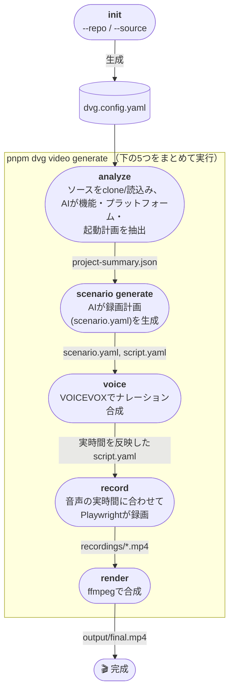

# demo-video-gen

Webアプリ向けのAIプロモーション動画自動生成ツールです。実在するgit管理プロジェクトを
指定すると、実際のソースコードを読み込み、録画計画を立て、実ブラウザを操作し、
ナレーション付きの動画を生成します。

---

## 必要な環境

Node.js ≥ 20、pnpm ≥ 9、git、Docker（VOICEVOX用）。それ以外（ffmpeg、Playwright、
Task、任意でOllama）は下のセットアップコマンドがまとめてインストールします。

## クイックスタート

```bash
git clone <このリポジトリ> && cd demo-video-gen

task install          # 初回のみ: 必要なもの一式をインストール（内訳は task --list）
task serve            # ローカルサービスを起動（VOICEVOX、Ollama）
task doctor           # 何か足りてるか不安なら実行

# 動画化したいプロジェクトと、それが動くURLを指定
pnpm dvg project init --repo https://github.com/you/your-app.git --url http://localhost:3000
#   ローカルに既にある場合は: --source ../your-app

pnpm dvg video generate # 動画を作る
```

`init`が`dvg.config.yaml`を生成します。動画化するソースがGitHub等にある場合は`--repo`、
ローカルにある場合は`--source`を使います。非エンジニア向け・使い方中心という編集方針は
ツール本体のデフォルトなので、設定ファイルへの追記は不要です。

VOICEVOX EngineやOllamaを別の`docker compose up -d`で起動している場合、`task serve`は
省略できます。その場合もホスト側からVOICEVOXの`http://localhost:50021`とOllamaの
`http://localhost:11434`へ到達できるよう、Composeでポートを公開してください。
`task doctor`、または次のコマンドで起動状態を確認できます。

```bash
curl http://localhost:50021/version
curl http://localhost:11434/api/tags  # Ollamaを使う場合のみ
```

`task`コマンドが無くても、下記はすべて`pnpm install`だけで動きます — 各`task`コマンドが
実際に何をしているかは[Taskfile.yml](./Taskfile.yml)に、`pnpm run <name>`という
素のエイリアスは[package.json](./package.json)にあります。

出力先は完成動画が`output/final.mp4`、途中生成物が`output/artifacts/`です。
`artifacts/`にはscenario/script、字幕、WAV音声、シーン録画、スクリーンショット、
timeline、分析結果、ログ、使用した設定が保存されます。`GEMINI_API_KEY`を設定して
いない場合は自動的にOllamaが使われます。設定項目の全リストは`examples/dvg.config.yaml`を見てください（各項目に
コメントで説明が書いてあるので、ここでは重複させません）。

---

## 全体の流れ


```mermaid
flowchart TD
    init(["<b>init</b><br/>--repo / --source"]) -->|生成| cfg[(dvg.config.yaml)]

    subgraph build["pnpm dvg video generate （下の5つをまとめて実行）"]
        direction TB
        analyze(["<b>analyze</b><br/>ソースをclone/読込み、<br/>AIが機能・プラットフォーム・<br/>起動計画を抽出"])
        scenario(["<b>scenario generate</b><br/>AIが録画計画<br/>(scenario.yaml)を生成"])
        voice(["<b>voice</b><br/>VOICEVOXでナレーション合成"])
        record(["<b>record</b><br/>音声の実時間に合わせて<br/>Playwrightが録画"])
        render(["<b>render</b><br/>ffmpegで合成"])
        analyze -->|project-summary.json| scenario
        scenario -->|scenario.yaml, script.yaml| voice
        voice -->|実時間を反映したscript.yaml| record
        record -->|recordings/*.mp4| render
    end

    cfg --> analyze
    render -->|output/final.mp4| done(["🎬 完成"])
```

## 実行方法：一括実行と個別実行

上図の各箱はそれぞれ独立したCLIコマンドで、すべて`.dvg/`配下のファイルを読み書きします。
つまり`build`はブラックボックスではなく、単にこの5つを順番に実行しているだけです。

通常は次の一括実行だけで構いません。

```bash
pnpm dvg video generate
```

内容を途中で確認・編集したい場合は、必ず次の順番で個別実行します。

```bash
pnpm dvg project analyze
pnpm dvg video scenario generate
pnpm dvg video voice     # WAV生成後、実音声の長さでscript/subtitlesを更新
pnpm dvg video record    # 更新済みscriptとWAVが必須
pnpm dvg video render
```

各コマンドは直前の生成物を使います。途中で止まった場合、成功済みの工程を繰り返す必要は
ありません。再開位置の目安は次のとおりです。

| 最後に成功した工程／変更内容 | 再開コマンド |
|---|---|
| `analyze`まで成功 | `pnpm dvg video scenario generate` |
| `scenario generate`まで成功 | `pnpm dvg video voice` |
| `voice`まで成功 | `pnpm dvg video record` |
| `record`まで成功 | `pnpm dvg video render` |
| narration・テロップ文言を変更 | `pnpm dvg video voice`から |
| 画面操作だけを変更 | `pnpm dvg video record`から |
| 録画・音声は完成済みで合成設定だけ変更 | `pnpm dvg video render`のみ |

| コマンド | 生成物 | 補足 |
|---|---|---|
| `pnpm dvg project init --repo <URL>` | `dvg.config.yaml` | 初回のみ。ローカルの場合は`--source <パス>` |
| `pnpm dvg project analyze` | `.dvg/source-context.json`、`.dvg/project-summary.json` | 決定論的なソース走査 + AIによる分類 |
| `pnpm dvg video scenario generate` | `.dvg/scenario.yaml`、`.dvg/script.yaml`、`.dvg/subtitles.srt` | scenarioはAI生成、script/subtitlesはそこから決定論的に算出 |
| `pnpm dvg video voice` | `.dvg/voice/*.wav` | 実音声の長さでscript/subtitlesの時刻も更新 |
| `pnpm dvg video record` | `.dvg/recordings/*.mp4` | 音声の実時間に合わせて操作し、到達不能なら停止 |
| `pnpm dvg video render` | `output/final.mp4`、`output/artifacts/` | 完成動画と途中生成物一式を出力 |

`pnpm dvg video generate [--skip-analyze] [--skip-scenario] [--skip-record] [--skip-voice]`
は上記5つをまとめて実行し、指定したステップだけ既存の生成物を使って
スキップできます。各コマンドの全オプションは`--help`で確認できます
（例: `pnpm dvg project analyze --help`）。CLI全体は`pnpm dvg --help`で確認できます。

`--skip-voice`と録画を組み合わせる場合も、既存の`.dvg/voice/*.wav`が必要です。
録画前に既存WAVを測り直すため、音声なしの状態で録画だけを先行することはできません。
ナレーションや`sceneGapSeconds`を変更した場合は、`voice → record → render`を再実行してください。

---

## 設定ファイル

`dvg.config.yaml` — 全項目の説明は**[`examples/dvg.config.yaml`](./examples/dvg.config.yaml)**
にコメント付きで書いてあります（gitソース指定、対象URL、動画タイプ、LLMプロバイダー/
フォールバック/タスク別モデル、VOICEVOX等）。ここでは意図的に重複させていません
— あのファイル自体がドキュメントです。

最初に知っておくとよいのは以下の4点です。

- **LLMプロバイダー**: `gemini`（`GEMINI_API_KEY`が必要）か`ollama`（完全ローカル、
  キー不要）。`init`はその時点で使えるほうを自動選択します。APIキーが設定済みの
  プロバイダーだけを`fallbackProvider`に指定できます。必須APIキーが未設定の
  フォールバックは自動的に無効化されます。`analyze`と`scenario generate`は`llm.tasks`で**別々の
  モデル**を指定可能です — `scenario generate`のほうが難しいタスクなので、
  `analyze`より強いモデルが必要になることがあります。
- **アプリの起動**: `analyze`が`package.json`から起動コマンド（`npm run dev`等）を
  自動検出し、`scenario.yaml`の`setup`計画に焼き込みます。`record`/`build`は
  それを使って自動的にアプリを起動します。`target.url`へ到達できない場合やブラウザ操作が
  失敗した場合は、白画面や部分録画を完成品にせずエラーで停止します。
- **シーン間の無音**: `video.sceneGapSeconds`（デフォルト`1`秒）で、ナレーションと
  シーンの間隔を調整できます。この値は音声合成後のscript、字幕、録画時間へ反映されます。
- **編集方針**: 設定不要の組み込みデフォルトとして、非エンジニアを対象に、技術仕様では
  なく実際の使い方、できること、利用者のメリットを紹介します。
  App Router、TypeScript、Cloudflare、Hono、APIなどの実装用語がナレーションへ
  入った場合は検証エラーとして再生成されます。

---

## トラブルシューティング

### `scenario generate`がスキーマ検証で何度も失敗する

使っているモデルがそのタスクに向いていない可能性が高いです。`llm.tasks.scenario`
だけを別の（より強い）モデルに向けてください（`examples/dvg.config.yaml`参照）。
`analyze`側の設定は変えなくて大丈夫です。警告メッセージには、モデルが具体的に
どのフィールドを間違えたかも表示されます。

### `pnpm install`がffmpegやtaskのダウンロードで失敗する

`ffmpeg-static`や`@go-task/cli`はGitHubリリースからバイナリをダウンロードする
postinstallスクリプトを持っており、社内プロキシ等でブロックされると失敗することが
あります。まず再実行してみてください。ffmpegは手動インストールしても自動検出されます
（`winget install ffmpeg` / `brew install ffmpeg` / `apt install ffmpeg`）。`task`が
無くても`pnpm run <name>`側で代替できます。

### `pnpm run build`や`pnpm dvg`が`ERR_PNPM_IGNORED_BUILDS`で失敗する

```bash
pnpm approve-builds
```
を実行し、`ffmpeg-static` / `@go-task/cli` / `esbuild`を承認してください。

### `pnpm dvg project init`が「--repo か --source が必要」と言う

`analyze`が実際のソースコードを読む設計のため、`init`の時点で対象を指定する必要が
あります: `pnpm dvg project init --repo <URL>` または `--source <パス>`（gitリポジトリ
である必要あり）。

### `scenario.yaml`のURLが実際のページと合っていない

自動ルート検出は現時点でNext.js（App/Pages Router）のみ対応です。
`.dvg/source-context.json`の`routes`が空なら、AIがファイル一覧から推測しているため
精度が落ちます。`scenario.yaml`の`goto`アクションを手動で修正してから`record`して
ください。

### VOICEVOX / Ollamaに接続できない

```bash
task serve          # 両方まとめて起動を試みる
task doctor          # 何が足りないか診断
```

Docker Composeを使う場合は、少なくともVOICEVOXの`50021:50021`を公開してください。
Ollamaもコンテナで動かす場合は`11434:11434`が必要です。`voice`が成功する前に`record`へ
進むことはできません。

### 録画が対象URLやブラウザ操作のエラーで停止する

まず`target.url`を通常のブラウザで開けるか確認してください。次に`.dvg/scenario.yaml`の
`goto`、`click`、`wait_visible`が実際の画面と合っているか確認します。修正後は音声を
変えていなければ`pnpm dvg video record`、ナレーションも変えた場合は
`pnpm dvg video voice`から再実行してください。

### とにかく何もわからない

```bash
task doctor
```

---

## 開発

```
packages/
├── cli/          コマンド定義（Commander） + 実行ロジック
├── core/         共通の型定義（Zodスキーマ — 正確なフィールド定義はここを見てください）
├── source/       gitクローン/ローカル読込み、ルート・プラットフォーム検出
├── ai/           LLMプロバイダー + analyze/scenario-generateパイプライン
├── playwright/   録画
├── voicevox/     音声合成
└── renderer/     ffmpegレンダリング

scripts/doctor.ts   環境診断（task doctor）
Taskfile.yml        環境構築・サーバー起動
```

```bash
task build          # または: pnpm run build
pnpm dvg --help     # 整理されたCLIのコマンド一覧
```

## ライセンス

MIT
