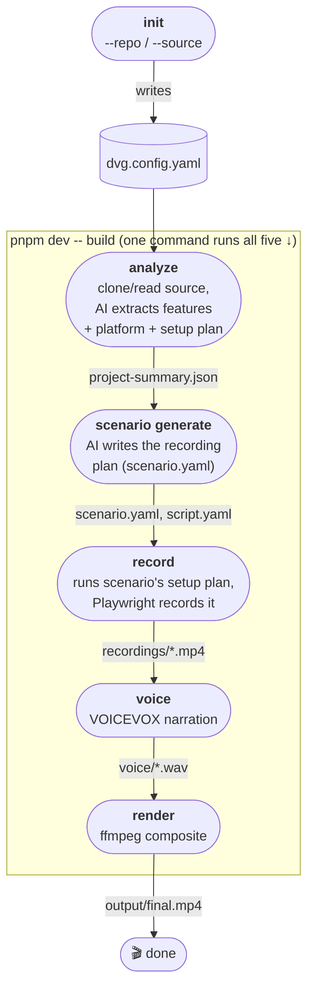

# demo-video-gen

AI-powered promotional video generator for web apps. Point it at a real
git-managed project; it reads the actual source, plans a recording, drives
a real browser through it, and produces a narrated video.

日本語版: [README-ja.md](./README-ja.md) — より詳しいトラブルシューティング付き

---

## Requirements

Node.js ≥ 20, pnpm ≥ 9, git, Docker (for VOICEVOX). Everything else
(ffmpeg, Playwright, Task, and optionally Ollama) is installed by the setup
command below.

## Quick Start

```bash
git clone <this-repo> && cd demo-video-gen

task install          # one-time: installs everything (see task --list)
task serve             # starts local services (VOICEVOX, Ollama)
task doctor             # not sure something's set up right? check here

# Point it at the project you want a video for, and where it'll be running:
pnpm dev -- init --repo https://github.com/you/your-app.git --url http://localhost:3000
#   or: --source ../your-app   (for a project already checked out locally)

pnpm dev -- build       # go make the video
```

No `task` binary? `pnpm install` alone still works for everything below —
see [Taskfile.yml](./Taskfile.yml) for what each `task` command actually
runs, or just use the plain `pnpm run <name>` equivalents in
[package.json](./package.json).

Output: `output/final.mp4`. First run without `GEMINI_API_KEY` set uses
Ollama automatically — see `examples/dvg.config.yaml` for every config
option (each one is commented inline, not duplicated here).

---

## How it works



Each box above is its own CLI command, reading/writing files under `.dvg/`
— so `build` isn't a black box, it's just those five in a row. Run them
individually to resume from anywhere (e.g. hand-edit `scenario.yaml`, then
just re-run from `record`):

| Command | Produces | Notes |
|---|---|---|
| `demo-video-gen init --repo <url>` | `dvg.config.yaml` | one-time; `--source <path>` for a local checkout instead |
| `demo-video-gen analyze` | `.dvg/source-context.json`, `.dvg/project-summary.json` | deterministic source scan + AI classification |
| `demo-video-gen scenario generate` | `.dvg/scenario.yaml`, `.dvg/script.yaml`, `.dvg/subtitles.srt` | scenario is AI; script/subtitles are derived deterministically from it |
| `demo-video-gen record` | `.dvg/recordings/*.mp4` | auto-starts the app first if `target.url` isn't reachable |
| `demo-video-gen voice` | `.dvg/voice/*.wav` | |
| `demo-video-gen render` | `output/final.mp4` | |

`demo-video-gen build [--skip-analyze] [--skip-scenario] [--skip-record] [--skip-voice]`
runs all five, skipping (reusing existing output for) whichever steps you
name. Every command's full option list is in `--help`
(e.g. `pnpm dev -- analyze --help`).

---

## Configuration

`dvg.config.yaml` — see **[`examples/dvg.config.yaml`](./examples/dvg.config.yaml)**
for the full reference, every option commented inline (git source, target
URL, video type, LLM provider/fallback/per-task overrides, VOICEVOX). Not
duplicated here on purpose — that file *is* the documentation for it.

Two things worth knowing up front:

- **LLM provider**: `gemini` (needs `GEMINI_API_KEY`) or `ollama` (fully
  local, no key). `init` picks whichever you have available; set
  `fallbackProvider` to use both. `analyze` and `scenario generate` can use
  *different* models via `llm.tasks` — useful since `scenario generate` is
  a harder task and sometimes needs a stronger model than `analyze` does.
- **Starting the app**: `analyze` tries to detect a start command
  (`npm run dev`, etc.) from `package.json` and bakes it into
  `scenario.yaml`'s `setup` plan; `record`/`build` run it automatically.

---

## Troubleshooting

- **`scenario generate` fails schema validation repeatedly** — the model
  isn't a great fit for that task. Point `llm.tasks.scenario` at a
  different/stronger model (see `examples/dvg.config.yaml`) without
  changing what `analyze` uses.
- **`pnpm install` fails downloading ffmpeg/task binaries**, or
  **`ERR_PNPM_IGNORED_BUILDS`** — see the Japanese README's
  troubleshooting section (same content, more detail):
  [README-ja.md#トラブルシューティング](./README-ja.md).
- **Nothing works and you don't know why** — `task doctor`.

---

## Development

```
packages/
├── cli/          Commands (Commander) + runners
├── core/         Shared types (Zod schemas — read these for exact field definitions)
├── source/       git clone/local checkout, route + platform detection
├── ai/           LLM providers + analyze/scenario-generate pipelines
├── playwright/   Recording
├── voicevox/     Voice synthesis
└── renderer/     ffmpeg rendering

scripts/doctor.ts   environment diagnostics (task doctor)
Taskfile.yml        environment setup & service orchestration
```

```bash
task build          # or: pnpm run build
task dev -- <args>  # or: pnpm dev -- <args>  (builds first, then runs the CLI)
```

## License

MIT
