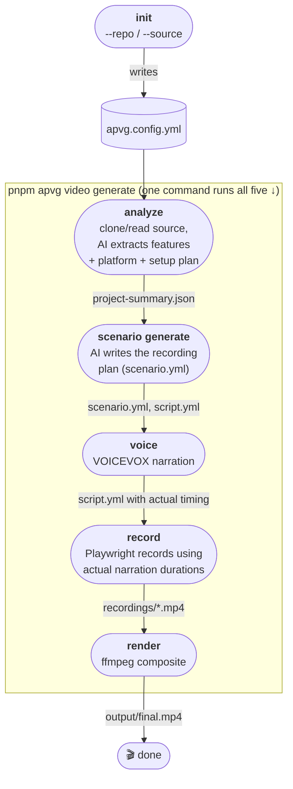

# auto-product-video-generator

AI-powered promotional video generator for web and Android apps. Point it at
a real git-managed project; it reads the actual source, plans a recording,
drives a browser or Android device, and produces a narrated video. Flutter,
React Native, and Unity are supported when targeting an Android build.

For conventional Android, Flutter, and React Native repositories, APVG can
build a debug APK, reuse a connected device or start the first installed AVD,
wait for Android to boot, detect the application id, install the APK, and
record through adb. Create at least one AVD in Android Studio first. Unity and
custom builds can provide `target.android.buildCommand` or an existing APK.
Set the SDK root with `target.android.sdkPath`, `ANDROID_SDK_ROOT`, or
`ANDROID_HOME`.

日本語版: [README-ja.md](./README-ja.md) — より詳しいトラブルシューティング付き

---

## Runtime dependencies

The npm package does not enforce a Node.js or package-manager version. External
tools are needed only for the features that use them: git for repository
sources, Docker or another VOICEVOX Engine installation for narration, and the
Android SDK for Android recording. The repository setup command installs the
remaining development tools, including ffmpeg, Playwright, Task, and optionally
Ollama.

## Install from npm

```bash
npm install --global auto-product-video-generator
apvg --help
```

The npm package installs the CLI and its JavaScript dependencies with npm; it
does not require pnpm at runtime. External services and tools listed above are
still required only for their corresponding features. In particular,
install Playwright Chromium with `npx playwright install chromium`, and run a
VOICEVOX Engine instance on port `50021`. Ollama is optional when
`GEMINI_API_KEY` is configured.

## Quick Start

```bash
git clone <this-repo> && cd auto-product-video-generator

task install          # one-time: installs everything (see task --list)
task serve            # starts local services (VOICEVOX, Ollama)
task doctor           # not sure something's set up right? check here

# Point it at the project; its local URL/start command are inferred from source:
pnpm apvg project init --repo https://github.com/you/your-app.git
#   or: --source ../your-app   (for a project already checked out locally)

pnpm apvg video generate # generate the video
```

`init` generates `apvg.config.yml`. Use `--repo` for a remote repository or
`--source` for a local checkout. The non-technical, product-usage editorial
direction is built in and does not need a config entry.
When `--url` is omitted, the LLM reads package scripts and the README to infer
the start command and loopback URL (including its port), then saves that URL to
the config. Pass `--url http://localhost:3000` only when you want an explicit
value; an explicit URL is never replaced by inference.

Monorepos normally need no extra configuration. After every clone/update, APVG
scans the workspace and prioritizes a runnable web application such as
`apps/web`; its selected path is recorded as `projectPath` in
`.apvg/source-context.json`. If the automatic choice is not the intended app,
change `source.platformPriority` (web is first by default). To pin one app,
use `--project-path apps/web` or set `source.projectPath`. Init also accepts a
comma-separated order such as `--platform-priority web,android,flutter`.
Dependencies run at the workspace root while the dev server runs in the
selected application directory.

If VOICEVOX Engine and Ollama are already running through your own
`docker compose up -d`, skip `task serve`. Expose VOICEVOX on host port
`50021` and, when using Ollama, expose it on `11434`. Verify them with
`task doctor`, `curl http://localhost:50021/version`, and optionally
`curl http://localhost:11434/api/tags`.

`pnpm apvg` uses development-condition package exports and `tsx` to run every
workspace package from TypeScript source, even in a clean checkout, so no
pre-build is required. `pnpm build` is only for CI/release type-checking and
JavaScript output.

No `task` binary? `pnpm install` alone still works for everything below —
see [Taskfile.yml](./Taskfile.yml) for what each `task` command actually
runs, or just use the plain `pnpm run <name>` equivalents in
[package.json](./package.json).

Output: `output/final.mp4`, with intermediate files under `output/artifacts/`
(scenario/script, subtitles, WAV narration, scene recordings, screenshots,
timeline, analysis results, logs, and the effective config). First run without
`GEMINI_API_KEY` set uses Ollama automatically — see `examples/apvg.config.yml` for every config
option (each one is commented inline, not duplicated here).

## GitHub Actions generation

[generate-demo.yml](./.github/workflows/generate-demo.yml) runs entirely on a
GitHub-hosted `ubuntu-latest` runner. It starts automatically on every push to
`main` and can also be started manually with `Run workflow`.

The target repository is supplied through the `target_repository` input for a
manual run, or through a `TARGET_REPOSITORY` repository variable for a
push-triggered run. No personal target repository is built into the workflow.
The job installs Node.js, pnpm, Playwright Chromium, system ffmpeg, Ollama, and
VOICEVOX Engine. It selects
`qwen2.5:14b-instruct` with at least 15 GB RAM and 11 GB free disk, then falls
back through 7B to 3B as resources decrease. Pipeline stages run separately;
the Ollama model is removed after scenario generation to release both RAM and
disk before VOICEVOX and browser media processing.
No Gemini secret is required. Successful runs upload
`output/` as `promotional-video-<run number>`; failed runs upload `.apvg/` and
service logs for diagnosis. The job allows up to six hours because local LLM
generation is CPU-bound on GitHub-hosted runners.

---

## How it works


```mermaid
flowchart TD
    init(["<b>init</b><br/>--repo / --source"]) -->|writes| cfg[(apvg.config.yml)]

    subgraph build["pnpm apvg video generate  (one command runs all five ↓)"]
        direction TB
        analyze(["<b>analyze</b><br/>clone/read source,<br/>AI extracts features<br/>+ platform + setup plan"])
        scenario(["<b>scenario generate</b><br/>AI writes the recording<br/>plan (scenario.yml)"])
        voice(["<b>voice</b><br/>VOICEVOX narration"])
        record(["<b>record</b><br/>Playwright records using<br/>actual narration durations"])
        render(["<b>render</b><br/>ffmpeg composite"])
        analyze -->|project-summary.json| scenario
        scenario -->|scenario.yml, script.yml| voice
        voice -->|script.yml with actual timing| record
        record -->|recordings/*.mp4| render
    end

    cfg --> analyze
    render -->|output/final.mp4| done(["🎬 done"])
```

## Running all at once or step by step

Each box above is its own CLI command, reading/writing files under `.apvg/`
— so `build` isn't a black box, it's just those five in a row. Run them
`pnpm apvg video generate` for the normal all-in-one path. To inspect or edit
intermediate results, run these commands in this exact order:

```bash
pnpm apvg project analyze
pnpm apvg video scenario generate
pnpm apvg video voice     # synthesizes WAVs and applies their actual timing
pnpm apvg video record    # requires the timed script and WAVs
pnpm apvg video render
```

Resume from the first unfinished or affected step:

| Last successful step / change | Resume with |
|---|---|
| analyze completed | `pnpm apvg video scenario generate` |
| scenario completed | `pnpm apvg video voice` |
| voice completed | `pnpm apvg video record` |
| recording completed | `pnpm apvg video render` |
| narration/subtitle text changed | start from `pnpm apvg video voice` |
| browser actions only changed | start from `pnpm apvg video record` |
| only render settings changed | run `pnpm apvg video render` |

| Command | Produces | Notes |
|---|---|---|
| `pnpm apvg project init --repo <url>` | `apvg.config.yml` | one-time; `--source <path>` for a local checkout instead |
| `pnpm apvg project analyze` | `.apvg/source-context.json`, `.apvg/project-summary.json` | deterministic source scan + AI classification |
| `pnpm apvg video scenario generate` | `.apvg/scenario.yml`, `.apvg/script.yml`, `.apvg/subtitles.srt` | scenario is AI; script/subtitles are derived deterministically from it |
| `pnpm apvg video voice` | `.apvg/voice/*.wav` | also updates script/subtitle timing from actual audio |
| `pnpm apvg video record` | `.apvg/recordings/*.mp4` | paces actions to audio timing; fails if the target is unreachable |
| `pnpm apvg video render` | `output/final.mp4`, `output/artifacts/` | final video plus intermediate artifacts |

`pnpm apvg video generate [--skip-analyze] [--skip-scenario] [--skip-record] [--skip-voice]`
runs all five, skipping (reusing existing output for) whichever steps you
name. Every command's full option list is in `--help`
(e.g. `pnpm apvg project analyze --help`). Run `pnpm apvg --help` for the complete hierarchy.

Recording cannot run before voice synthesis. When combining
`--skip-voice` with recording, existing `.apvg/voice/*.wav` files are still
required and are measured again before recording. After changing narration
or `video.sceneGapSeconds`, rerun `voice → record → render`.

---

## Configuration

`apvg.config.yml` — see **[`examples/apvg.config.yml`](./examples/apvg.config.yml)**
for the full reference, every option commented inline (git source, target
URL, video type, LLM provider/fallback/per-task overrides, VOICEVOX). Not
duplicated here on purpose — that file *is* the documentation for it.

Three things worth knowing up front:

- **LLM provider**: `gemini` (needs `GEMINI_API_KEY`) or `ollama` (fully
  local, no key). `init` picks whichever you have available. A configured
  fallback is enabled only when its required API key is present, so an
  Ollama-only setup never fails on a missing cloud key. `analyze` and `scenario generate` can use
  *different* models via `llm.tasks` — useful since `scenario generate` is
  a harder task and sometimes needs a stronger model than `analyze` does.
- **Starting the app**: `analyze` tries to detect a start command
  (`npm run dev`, etc.) from `package.json` and bakes it into
  `scenario.yml`'s `setup` plan; `record`/`build` run it automatically.
  Recording stops with an error instead of rendering blank/partial footage
  when the target is unreachable or a browser action fails.
- **Scene gaps**: `video.sceneGapSeconds` (default: `1`) controls the silent
  interval between narration clips/scenes. Voice synthesis applies it to
  script, subtitle, and recording timing.
- **Web page settling**: `video.pageReadyWaitSeconds` (default: `2`) adds a
  delay after the initial page finishes loading. The loading/settling section
  is trimmed, so narration and subtitles begin on a ready page.
- **Editorial direction**: the built-in default teaches non-technical viewers
  how to use the product and what they gain from it; no config entry is needed.
  Implementation terms such as frameworks, programming
  languages, hosting, and APIs are rejected from narration and regenerated.

---

## Troubleshooting

- **`scenario generate` fails schema validation repeatedly** — the model
  isn't a great fit for that task. Point `llm.tasks.scenario` at a
  different/stronger model (see `examples/apvg.config.yml`) without
  changing what `analyze` uses.
- **`pnpm install` fails downloading ffmpeg/task binaries**, or
  **`ERR_PNPM_IGNORED_BUILDS`** — see the Japanese README's
  troubleshooting section (same content, more detail):
  [README-ja.md#トラブルシューティング](./README-ja.md).
- **Nothing works and you don't know why** — `task doctor`.
- **Recording stops on a URL or browser-action error** — first open
  `target.url` in a normal browser, then verify the `goto`, `click`, and
  `wait_visible` actions in `.apvg/scenario.yml`. Rerun from `record` if
  narration is unchanged, or from `voice` if narration changed.

---

## Development

```
packages/
├── cli/          Commands (Commander) + runners
├── core/         Shared types (Zod schemas — read these for exact field definitions)
├── source/       git clone/local checkout, route + platform detection
├── ai/           LLM providers + analyze/scenario-generate pipelines
├── playwright/   Recording
├── voicevox/     Voice synthesis
└── renderer/     ffmpeg rendering

scripts/doctor.ts   environment diagnostics (task doctor)
Taskfile.yml        environment setup & service orchestration
```

```bash
task build          # or: pnpm run build (CI/release type-check + JS output)
pnpm apvg --help     # show the organized CLI command hierarchy
```

### Publishing to npm

All workspace packages share one version and are published together because
the public `auto-product-video-generator` CLI depends on the scoped internal packages.

```bash
npm login
pnpm release:check  # build, test, and show the packages that would be published
pnpm publish:npm    # publish every package in dependency order
```

Before the first release, confirm that the npm account owns the
`@auto-product-video-generator` scope and that the unscoped `auto-product-video-generator` name is
available. Publishing requires a clean, committed git working tree. For later
releases, update all eight package versions together before publishing.

## License

MIT
