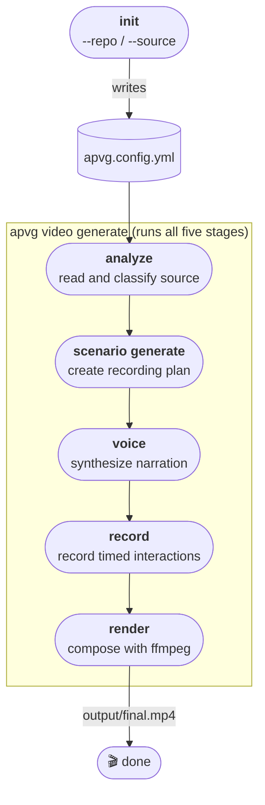

# auto-product-video-generator

AI-powered promotional video generator for web, CLI, and Android applications.
APVG reads a real git-managed project, plans the presentation, records the
application, and produces a narrated video.

日本語版: [README-ja.md](./README-ja.md)

## Supported platforms

| Target                 | Recording method                                   | Status        |
| ---------------------- | -------------------------------------------------- | ------------- |
| Web application        | Playwright Chromium                                | Supported     |
| CLI application        | Browser terminal running in Docker                 | Supported     |
| Android                | Device or emulator recording through adb           | Supported     |
| Flutter / React Native | Build an Android APK and record through adb        | Supported     |
| Unity Android          | Record an existing or custom-built APK through adb | Supported     |
| iOS / Unity Desktop    |                                                    | Not supported |

---

## Setup

### 1. Install the required tools

| Tool                | Required for                                     | Installation                                                      |
| ------------------- | ------------------------------------------------ | ----------------------------------------------------------------- |
| Node.js 20 or newer | All usage                                        | [Node.js](https://nodejs.org/)                                    |
| git                 | Reading the target repository                    | [Git downloads](https://git-scm.com/downloads)                    |
| Docker              | Starting VOICEVOX and recording CLI applications | [Docker Desktop](https://www.docker.com/products/docker-desktop/) |
| Ollama              | Using a local LLM                                | [Ollama downloads](https://ollama.com/download)                   |

APVG can use Ollama or Gemini. To use Gemini, create an API key in
[Google AI Studio](https://aistudio.google.com/apikey) and set
`GEMINI_API_KEY`; Ollama is then optional. Android recording requires the
additional setup described under [Recording Android applications](#recording-android-applications).

### 2. Install APVG

```bash
npm install --global auto-product-video-generator
apvg setup
apvg doctor
apvg --help
```

`apvg setup` installs the Playwright Chromium browser. The npm package does not
require pnpm or a clone of this repository. Run `apvg doctor` to check tools and
services.

## Quick start

Run APVG from a directory where it can save its configuration and output:

```bash
mkdir my-product-video
cd my-product-video

# Start VOICEVOX and, unless GEMINI_API_KEY is set, Ollama.
apvg serve

# Remote git repository:
apvg project init --repo https://github.com/you/your-app.git

# Or an existing local git repository:
# apvg project init --source ../your-app

apvg video generate
```

### Environment and service commands

| Command                  | Purpose                                                              |
| ------------------------ | -------------------------------------------------------------------- |
| `apvg setup`             | Install the Playwright Chromium browser managed by APVG              |
| `apvg doctor`            | Check Node.js, git, Docker, media tools, Chromium, LLM, and VOICEVOX |
| `apvg serve`             | Start VOICEVOX and, when needed, Ollama and its configured model     |
| `apvg serve --no-ollama` | Start only VOICEVOX                                                  |
| `apvg services status`   | Check VOICEVOX and Ollama connectivity                               |
| `apvg services stop`     | Stop the APVG-managed VOICEVOX container                             |

APVG leaves Ollama running because it may be managed by the operating system or
used by other applications. Use `apvg serve --help` to select an Ollama model or
VOICEVOX image.

## Recording Android applications

Install [Android Studio](https://developer.android.com/studio), then use its SDK
Manager to install Android SDK Platform-Tools, Android Emulator, and the SDK
required by the target application. Create at least one AVD in Device Manager
when using an emulator.

The SDK is normally detected from `ANDROID_SDK_ROOT`, `ANDROID_HOME`, or `PATH`.
Set `target.android.sdkPath` only when automatic detection cannot find it.

```bash
apvg project init --repo https://github.com/you/your-android-app.git
apvg video generate
```

APVG uses a connected device when available; otherwise it starts an installed
AVD. Use `target.android.serial`, `avd`, `buildCommand`, or `apkPath` only when
you need to override automatic selection. Generated scenarios favor safe launch,
wait, and swipe actions. Add `tap`, `input_text`, or `back` actions to
`.apvg/scenario.yml` when needed.

### Unity targeting Android

Unity build methods vary by project. Set `target.android.apkPath` to an existing
APK or provide `target.android.buildCommand`. Installation and recording are
automatic after the APK is available.

## Initialization and automatic detection

### Create the configuration

`apvg project init` writes `apvg.config.yml`. Use `--repo` for a remote git
repository or `--source` for a local one.

### Detect the URL and start command

When `--url` is omitted, APVG infers a development-server command and localhost
URL from `package.json` and the README. Pass an explicit value such as
`--url http://localhost:3000` when the URL is already known.

### Select an application from a monorepo

APVG automatically selects a runnable application. Set `source.projectPath` to
pin one application or `source.platformPriority` to change platform priority.

### Exclude files that should not be analyzed

Media, 3D models, build output, and other files unsuitable for text analysis are
excluded automatically. Files matched by `.gitignore` or `source.exclude` are
also omitted from LLM input.

### Find generated output

The finished video is written to `output/final.mp4`; intermediate artifacts are
written to `output/artifacts/`. Check services with `apvg services status`.

## Recording an authenticated web application

Configure a manual authentication state:

```yaml
target:
  url: 'https://example.com/dashboard'
  type: web
  auth:
    mode: manual
    loginUrl: 'https://example.com/login'
    successUrl: 'https://example.com/dashboard' # optional
    storageStatePath: './.apvg/auth/storage-state.json'
```

Then log in once:

```bash
apvg auth login
```

APVG saves the state when `successUrl` is reached. Without `successUrl`, press
Enter after completing login. Later web recordings reuse the state. It may
contain cookies and other credentials; never commit it, upload it as an
artifact, or share it. Authentication state is currently supported only for web
recording.

## GitHub Actions generation

[generate-demo.yml](./.github/workflows/generate-demo.yml) runs the pipeline on
GitHub-hosted `ubuntu-latest`. It runs on pushes to `main` and through
`Run workflow`. Manual runs accept a `target_repository`; otherwise the workflow
uses its `TARGET_REPOSITORY` value.

### Runner environment

The workflow prepares Node.js, pnpm, dependencies, Playwright Chromium, system
ffmpeg, Ollama with the models from `apvg.config.yml`, and VOICEVOX Engine. It
releases Ollama resources before media processing. Successful runs upload the
video and artifacts; failed runs upload diagnostic files and service logs.

### Choosing an Ollama model

The workflow uses the configured model. `qwen2.5:7b-instruct` is the recommended
balance of quality and runtime. On a larger runner, use a higher-performance
model such as `qwen2.5:14b-instruct`. Models can be selected globally or per task
with `llm.tasks.analyze` and `llm.tasks.scenario`.

GitHub-hosted runners execute Ollama on CPU, so runtime depends on model size.
The workflow timeout is six hours, and newer pushes cancel older runs for the
same branch.

---

## Pipeline


```mermaid
flowchart TD
    init(["<b>init</b><br/>--repo / --source"]) -->|writes| cfg[(apvg.config.yml)]
    subgraph build["apvg video generate (runs all five stages)"]
        direction TB
        analyze(["<b>analyze</b><br/>read and classify source"])
        scenario(["<b>scenario generate</b><br/>create recording plan"])
        voice(["<b>voice</b><br/>synthesize narration"])
        record(["<b>record</b><br/>record timed interactions"])
        render(["<b>render</b><br/>compose with ffmpeg"])
        analyze --> scenario --> voice --> record --> render
    end
    cfg --> analyze
    render -->|output/final.mp4| done(["🎬 done"])
```

## Running all at once or step by step

Use the all-in-one command for normal generation:

```bash
apvg video generate
```

To inspect or edit intermediate files, run the stages in order:

```bash
apvg project analyze
apvg video scenario generate
apvg video voice
apvg video record
apvg video render
```

| Last successful stage / change     | Resume with                    |
| ---------------------------------- | ------------------------------ |
| Analyze completed                  | `apvg video scenario generate` |
| Scenario completed                 | `apvg video voice`             |
| Voice completed                    | `apvg video record`            |
| Recording completed                | `apvg video render`            |
| Narration or subtitle text changed | Start from `apvg video voice`  |
| Recording actions changed          | Start from `apvg video record` |
| Only render settings changed       | Run `apvg video render`        |

| Command                          | Produces                                                        |
| -------------------------------- | --------------------------------------------------------------- |
| `apvg project init --repo <url>` | `apvg.config.yml`                                               |
| `apvg project analyze`           | `.apvg/source-context.json`, `.apvg/project-summary.json`       |
| `apvg video scenario generate`   | `.apvg/scenario.yml`, `.apvg/script.yml`, `.apvg/subtitles.srt` |
| `apvg video voice`               | `.apvg/voice/*.wav` and updated timing                          |
| `apvg video record`              | `.apvg/recordings/*.mp4`                                        |
| `apvg video render`              | `output/final.mp4`, `output/artifacts/`                         |

### Inspecting and adjusting output

| Operation                                    | Command                                           |
| -------------------------------------------- | ------------------------------------------------- |
| Generate a quick low-quality preview         | `apvg video generate --preview`                   |
| Show the browser while recording             | `apvg video generate --headed`                    |
| Generate without subtitle overlay            | `apvg video generate --no-subtitles`              |
| Render without narration                     | `apvg video render --no-voice`                    |
| Re-record one scene                          | `apvg video record --scene <scene-id>`            |
| Regenerate narration for one scene           | `apvg video voice --scene <scene-id>`             |
| Validate an edited scenario                  | `apvg video scenario validate .apvg/scenario.yml` |
| Preview the plan without external processing | `apvg video generate --dry-run`                   |

`apvg video generate` supports `--skip-analyze`, `--skip-scenario`,
`--skip-record`, and `--skip-voice` to reuse existing stage output. Existing
WAV files are still required when recording with `--skip-voice`.

## Recording CLI projects

APVG detects CLI projects from `package.json` and recognized CLI frameworks.
It runs the target in a temporary Docker container and records its output in a
browser terminal. The container is removed after recording.

Generated scenarios may use finite, read-only `--help` and `--version`
commands. Add other exact commands to `target.cli.allowedCommands`; patterns in
`target.cli.deniedCommandPatterns` always take precedence.

---

## Configuration

Configuration is stored in `apvg.config.yml`. See
[`examples/apvg.config.yml`](./examples/apvg.config.yml) for a complete example.
The table shows fallback behavior when a key is omitted; `project init` may
write values detected from the environment or source.

### Project and source

| YAML key                  | Feature              | Required       | Default                                                                                                | Description                         |
| ------------------------- | -------------------- | -------------- | ------------------------------------------------------------------------------------------------------ | ----------------------------------- |
| `project.name`            | Project name         | Yes            |                                                                                                        | Product name                        |
| `project.description`     | Product description  | No             |                                                                                                        | Optional context                    |
| `source.repository`       | Remote source        | One of the two |                                                                                                        | git repository URL                  |
| `source.localPath`        | Local source         | One of the two |                                                                                                        | Local git repository path           |
| `source.ref`              | git reference        | No             |                                                                                                        | Branch, tag, or commit              |
| `source.installDeps`      | Install dependencies | No             | `false`                                                                                                | Install before starting the app     |
| `source.startCommand`     | Start application    | No             | Auto-detected                                                                                          | Development-server command          |
| `source.projectPath`      | Monorepo selection   | No             | Auto-selected                                                                                          | Application directory               |
| `source.platformPriority` | Detection priority   | No             | `web`<br>`cli`<br>`android`<br>`flutter`<br>`react-native`<br>`unity`<br>`ios`<br>`desktop`<br>`other` | Platform priority order             |
| `source.exclude`          | Analysis exclusions  | No             | `[]`                                                                                                   | Additional gitignore-style patterns |

### Recording target

| YAML key                       | Feature               | Required | Default                           | Description                           |
| ------------------------------ | --------------------- | -------- | --------------------------------- | ------------------------------------- |
| `target.url`                   | Target URL            | Yes      |                                   | Web application or recording-page URL |
| `target.autoDetectUrl`         | URL detection         | No       | `false`                           | Adopt the inferred localhost URL      |
| `target.type`                  | Recorder              | No       | `web`                             | `web`<br>`cli`<br>`android`<br>`ios`  |
| `target.auth.mode`             | Web authentication    | No       | `manual`                          | Manual login mode                     |
| `target.auth.loginUrl`         | Login URL             | No       | `target.url`                      | Initial manual-login URL              |
| `target.auth.successUrl`       | Login completion      | No       |                                   | Save state after reaching this URL    |
| `target.auth.storageStatePath` | Authentication state  | No       | `./.apvg/auth/storage-state.json` | Playwright state file                 |
| `target.credentials`           | Legacy authentication | No       |                                   | Compatibility only; use `target.auth` |

### Android recording

| YAML key                           | Feature         | Required | Default               | Description                    |
| ---------------------------------- | --------------- | -------- | --------------------- | ------------------------------ |
| `target.android.package`           | Application ID  | No       | Auto-detected         | Android package/application ID |
| `target.android.activity`          | Launch activity | No       | Auto-detected         | Launcher activity              |
| `target.android.serial`            | Device          | No       | Auto-selected         | adb device serial              |
| `target.android.avd`               | Emulator        | No       | First installed AVD   | AVD to start                   |
| `target.android.apkPath`           | Existing APK    | No       | Automatic build       | APK path                       |
| `target.android.buildCommand`      | APK build       | No       | Platform-specific     | Custom build command           |
| `target.android.sdkPath`           | Android SDK     | No       | Environment or `PATH` | SDK root                       |
| `target.android.autoStartEmulator` | Start emulator  | No       | `true`                | Start an AVD when needed       |
| `target.android.autoInstall`       | Install APK     | No       | `true`                | Install before recording       |

### CLI recording

| YAML key                           | Feature          | Required | Default                                                                                                                                                                      | Description             |
| ---------------------------------- | ---------------- | -------- | ---------------------------------------------------------------------------------------------------------------------------------------------------------------------------- | ----------------------- |
| `target.cli.image`                 | Docker image     | No       | `apvg-cli-recorder:latest`                                                                                                                                                   | Recording image         |
| `target.cli.dockerfile`            | Dockerfile       | No       | Bundled Dockerfile                                                                                                                                                           | Custom image source     |
| `target.cli.shell`                 | Shell            | No       | `/bin/bash`                                                                                                                                                                  | Container shell         |
| `target.cli.columns` / `rows`      | Terminal size    | No       | `100`<br>`30`                                                                                                                                                                | Columns and rows        |
| `target.cli.fontSize`              | Font size        | No       | `22`                                                                                                                                                                         | Terminal font size      |
| `target.cli.allowedCommands`       | Allowed commands | No       | `[]`                                                                                                                                                                         | Exact command allowlist |
| `target.cli.deniedCommandPatterns` | Denied commands  | No       | `publish`<br>`login`<br>`logout`<br>`token`<br>`secret`<br>`clean`<br>`remove`<br>`delete`<br>`serve`<br>`start`<br>`watch`<br>`generate`<br>`voice`<br>`record`<br>`render` | Always-denied patterns  |

### Video

| YAML key                     | Feature            | Required | Default     | Description                                              |
| ---------------------------- | ------------------ | -------- | ----------- | -------------------------------------------------------- |
| `video.type`                 | Video structure    | No       | `demo`      | `teaser`<br>`shorts`<br>`demo`<br>`tutorial`             |
| `video.duration`             | Target duration    | No       | `60`        | Seconds                                                  |
| `video.resolution`           | Resolution         | No       | `1920x1080` | `1920x1080`<br>`1280x720`<br>`1080x1920`                 |
| `video.fps`                  | Frame rate         | No       | `30`        | `30` or `60`                                             |
| `video.language`             | Language           | No       | `ja`        | Scenario and narration language                          |
| `video.singleLineSubtitles`  | One-line subtitles | No       | `true`      | Show short timed cues; `false` shows the full scene text |
| `video.pageReadyWaitSeconds` | Web settling       | No       | `2`         | Wait after initial page load                             |
| `video.sceneGapSeconds`      | Scene gap          | No       | `1`         | Silence between narration clips                          |

### LLM

| YAML key                | Feature           | Required | Default                                               | Description                                            |
| ----------------------- | ----------------- | -------- | ----------------------------------------------------- | ------------------------------------------------------ |
| `llm.provider`          | Primary provider  | No       | `gemini`                                              | `gemini`<br>`openai`<br>`claude`<br>`groq`<br>`ollama` |
| `llm.model`             | Primary model     | No       | `gemini-2.5-pro`                                      | Model name                                             |
| `llm.apiKeyEnv`         | API key           | No       | Provider standard                                     | Environment-variable name                              |
| `llm.ollamaHost`        | Ollama endpoint   | No       | `http://localhost:11434`                              | Ollama API URL                                         |
| `llm.fallbackProvider`  | Fallback provider | No       |                                                       | Provider used after primary failure                    |
| `llm.fallbackModel`     | Fallback model    | No       | Ollama: `qwen2.5:7b-instruct`<br>Other: primary model | Model used by fallback                                 |
| `llm.fallbackApiKeyEnv` | Fallback API key  | No       | Provider standard                                     | Environment-variable name                              |
| `llm.tasks.analyze.*`   | Analyze LLM       | No       | Primary LLM                                           | Override `provider`, `model`, or `apiKeyEnv`           |
| `llm.tasks.scenario.*`  | Scenario LLM      | No       | Primary LLM                                           | Override `provider`, `model`, or `apiKeyEnv`           |

### Narration and output

| YAML key             | Feature           | Required | Default                  | Description                     |
| -------------------- | ----------------- | -------- | ------------------------ | ------------------------------- |
| `voicevox.host`      | VOICEVOX endpoint | No       | `http://localhost:50021` | Engine API URL                  |
| `voicevox.speakerId` | Speaker           | No       | `3`                      | VOICEVOX speaker ID             |
| `output.dir`         | Final output      | No       | `./output`               | Final output directory          |
| `output.workDir`     | Working data      | No       | `./.apvg`                | Scenario, audio, and recordings |

## License

MIT
